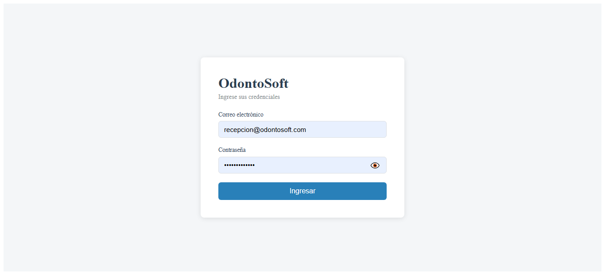
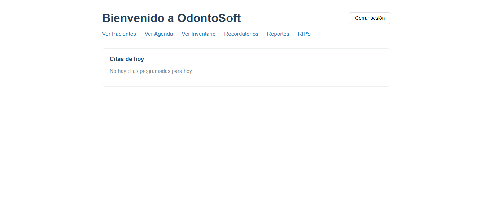
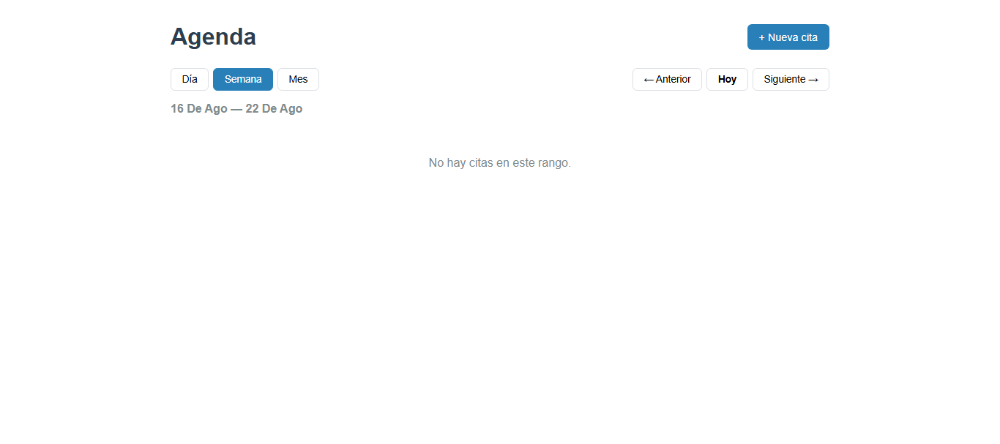
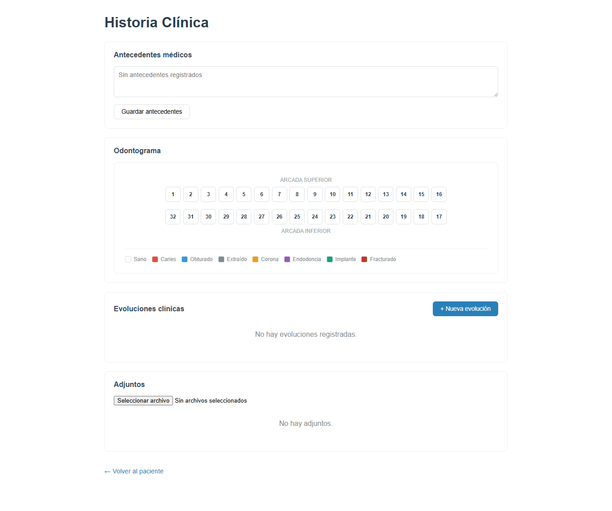
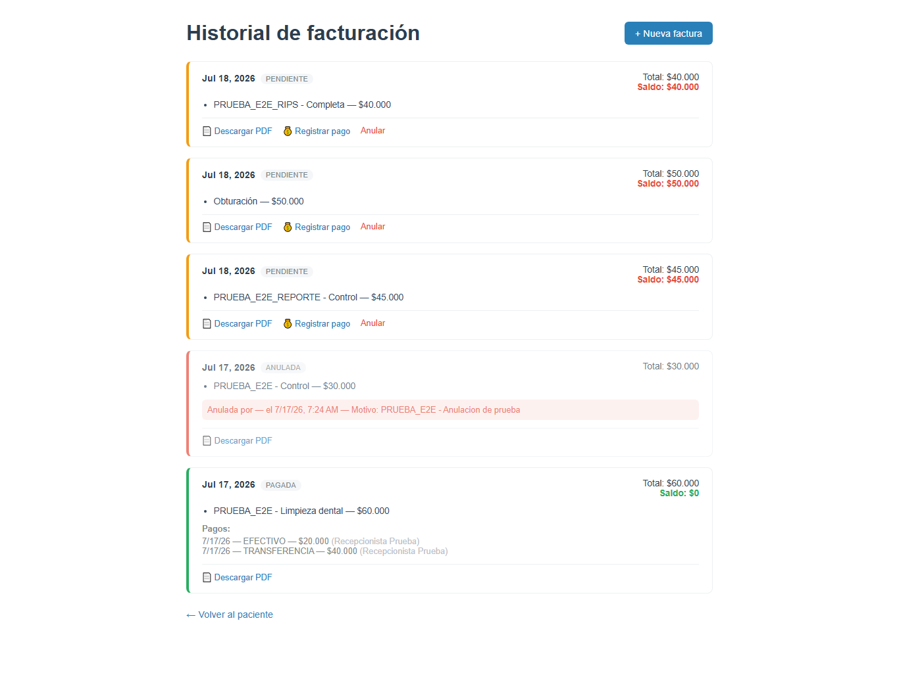

<div align="center">

# 🦷 OdontoSoft

**Sistema integral de gestión clínica odontológica**

*Historia clínica, agenda, facturación e inventario en una sola plataforma web.*

[](https://nodejs.org/)
[](https://angular.io/)
[](https://expressjs.com/)
[](https://www.mongodb.com/atlas)
[](LICENSE)
[]()
[]()

[🌐 Demo en vivo](https://odontosoft-frontend-3925.onrender.com) · [📘 Documentación](./docs) · [🐛 Reportar bug](https://github.com/juangarcesco/odontosoft-v2/issues) · [✨ Solicitar feature](https://github.com/juangarcesco/odontosoft-v2/issues)

</div>

---

## 📋 Tabla de Contenidos

- [Acerca del proyecto](#-acerca-del-proyecto)
- [Características](#-características)
- [Stack tecnológico](#-stack-tecnológico)
- [Arquitectura](#-arquitectura)
- [Módulos del sistema](#-módulos-del-sistema)
- [Screenshots](#-screenshots)
- [Comenzar](#-comenzar)
- [Uso](#-uso)
- [Despliegue](#-despliegue)
- [API Reference](#-api-reference)
- [Modelo de roles](#-modelo-de-roles)
- [Testing](#-testing)
- [Roadmap](#-roadmap)
- [Contribuir](#-contribuir)
- [Licencia](#-licencia)
- [Contacto](#-contacto)

---

## 🎯 Acerca del proyecto

**OdontoSoft** es una aplicación web para la gestión integral de consultorios odontológicos independientes. Digitaliza los procesos administrativos, clínicos y financieros del consultorio en una plataforma unificada, moderna y escalable.

Diseñado a partir del levantamiento riguroso de requisitos con profesionales del sector con más de una década de experiencia clínica, OdontoSoft prioriza la simplicidad operativa, la confidencialidad de la información de salud y la propiedad total de los datos por parte del consultorio.

### Problema que resuelve

Los consultorios odontológicos independientes suelen enfrentar tres barreras:

1. **Costos recurrentes elevados** de licencias SaaS especializadas ($200K–$500K COP mensuales).
2. **Software genérico** que no se adapta al flujo específico del profesional.
3. **Dependencia externa** de proveedores para acceder a los datos clínicos.

OdontoSoft resuelve estos tres problemas ofreciendo un sistema autoalojable, adaptado al flujo real del consultorio y con propiedad total de los datos.

---

## ✨ Características

- 🔐 **Autenticación robusta** con JWT + bcrypt y control de acceso por roles (RBAC).
- 👥 **Gestión completa de pacientes** con búsqueda insensible a tildes y por documento parcial.
- 📅 **Agenda visual** con detección automática de conflictos de horario.
- 🦷 **Historia clínica digital** con odontograma interactivo por diente y superficie (notación FDI).
- 💰 **Facturación** con soporte para pagos parciales y múltiples métodos de pago.
- 📦 **Inventario** de materiales con alertas automáticas de stock bajo.
- 🔔 **Recordatorios automáticos** por email (y WhatsApp en roadmap).
- 📊 **Reportes gerenciales** exportables a Excel y PDF.
- 🏥 **Generación de RIPS** conforme a normativa colombiana (Resolución 2275 de 2023).
- ☁️ **100% en la nube** con acceso multiplataforma vía navegador.
- 🌐 **Responsive** — funciona en desktop, tablet y móvil.

---

## 🛠 Stack tecnológico

**MEAN Stack + herramientas complementarias:**

| Capa | Tecnología |
|---|---|
| **Base de datos** | MongoDB Atlas 7.0 |
| **Backend** | Node.js 20 + Express 4 |
| **Frontend** | Angular 17 + TypeScript 5 |
| **Autenticación** | JSON Web Tokens (JWT) + bcrypt |
| **Estilos** | SCSS personalizado |
| **Email** | Nodemailer + Ethereal (desarrollo) |
| **Reportes** | ExcelJS + PDFKit |
| **Tareas programadas** | node-cron |
| **Testing E2E** | Cypress |
| **Optimización de imágenes** | Sharp |
| **Deployment** | Render (backend + frontend) + MongoDB Atlas |

---

## 🏗 Arquitectura

OdontoSoft implementa una **arquitectura en 3 capas desacopladas**:

```
┌─────────────────────────────────────────────────────────┐
│                      CLIENTE                            │
│              Angular 17 SPA (Static Site)               │
│                  Render Static Site                     │
└───────────────────────┬─────────────────────────────────┘
                        │ HTTPS + JWT
                        ▼
┌─────────────────────────────────────────────────────────┐
│                     BACKEND                             │
│         Node.js 20 + Express 4 REST API                 │
│                  Render Web Service                     │
│                                                         │
│   Rutas → Middleware → Controladores → Servicios        │
│                                    ↓                    │
│                              Modelos Mongoose           │
└───────────────────────┬─────────────────────────────────┘
                        │ MongoDB Wire Protocol
                        ▼
┌─────────────────────────────────────────────────────────┐
│                    PERSISTENCIA                         │
│              MongoDB Atlas Cluster M0                   │
│                    AWS us-east-1                        │
└─────────────────────────────────────────────────────────┘
```

### Principios de diseño

- **Separation of Concerns**: cada capa tiene una responsabilidad única y clara.
- **Defensa en profundidad**: validaciones en frontend Y backend.
- **RESTful**: endpoints diseñados siguiendo convenciones REST.
- **Stateless**: el backend no mantiene sesión; toda la información de autenticación viaja en el JWT.
- **Escalabilidad horizontal**: la arquitectura permite escalar cada capa independientemente.

---

## 📦 Módulos del sistema

OdontoSoft se organiza en **9 módulos funcionales**:

| # | Módulo | Descripción |
|:---:|---|---|
| 1️⃣ | **Autenticación** | Login con JWT, gestión de usuarios, auditoría de accesos |
| 2️⃣ | **Pacientes** | Registro, búsqueda avanzada, ficha detallada |
| 3️⃣ | **Citas y Agenda** | Programación con detección de conflictos, ciclo de vida de la cita |
| 4️⃣ | **Historia Clínica** | Odontograma interactivo, evoluciones cronológicas, adjuntos |
| 5️⃣ | **Facturación** | Facturas con pagos parciales, PDF, anulación con motivo |
| 6️⃣ | **Inventario** | Materiales, movimientos, alertas de stock bajo |
| 7️⃣ | **Recordatorios** | Envío automático 24h antes vía email |
| 8️⃣ | **Reportes** | Financieros, clínicos, administrativos (Excel + PDF) |
| 9️⃣ | **RIPS** | Generación de archivos JSON para reporte al Ministerio |

**Especificación funcional completa:** [Ver docs/Informe_Requisitos.md](./docs/02_Informe_Requisitos.md)

- 59 Requisitos Funcionales
- 14 Requisitos No Funcionales
- 10 Reglas de Negocio

---

## 📸 Screenshots

<div align="center">

| Login | Dashboard |
|:---:|:---:|
|  |  |

| Agenda | Odontograma |
|:---:|:---:|
|  |  |

| Facturación | Reportes |
|:---:|:---:|
|  |  |

</div>

---

## 🚀 Comenzar

### Prerrequisitos

- **Node.js** 20.x o superior — [Descargar](https://nodejs.org/)
- **npm** 10.x o superior (incluido con Node.js)
- **Angular CLI** 17.x — `npm install -g @angular/cli`
- **MongoDB** local o cuenta gratuita en [MongoDB Atlas](https://www.mongodb.com/atlas)
- **Git** — [Descargar](https://git-scm.com/)

### Instalación local

**1. Clonar el repositorio**

```bash
git clone https://github.com/juangarcesco/odontosoft-v2.git
cd odontosoft-v2
```

**2. Configurar el backend**

```bash
cd backend
npm install
cp .env.example .env
```

Edita `.env` con tus valores:

```env
PORT=3000
MONGODB_URI=mongodb+srv://<user>:<pass>@cluster.mongodb.net/odontosoft
JWT_SECRET=<clave-secreta-larga-y-aleatoria>
JWT_EXPIRES_IN=8h
EMAIL_HOST=smtp.ethereal.email
EMAIL_PORT=587
EMAIL_USER=<usuario-ethereal>
EMAIL_PASS=<password-ethereal>
CORS_ORIGIN=http://localhost:4200
```

Iniciar en modo desarrollo:

```bash
npm run dev
```

El backend estará disponible en `http://localhost:3000/api`.

**3. Configurar el frontend**

En una nueva terminal:

```bash
cd frontend
npm install
```

Edita `src/environments/environment.ts`:

```typescript
export const environment = {
  production: false,
  apiUrl: 'http://localhost:3000/api'
};
```

Iniciar el servidor de desarrollo:

```bash
ng serve
```

La aplicación estará disponible en `http://localhost:4200`.

**4. Sembrar datos iniciales (opcional)**

```bash
cd backend
npm run seed
```

Esto crea un usuario administrador por defecto:

- **Email:** `admin@odontosoft.co`
- **Contraseña:** `Admin123!` *(cambiar en primer inicio)*

---

## 💻 Uso

### Flujo básico

1. **Iniciar sesión** con las credenciales asignadas.
2. **Crear un paciente** en el módulo de pacientes.
3. **Programar una cita** en la agenda.
4. **Registrar la atención** en la historia clínica con marcado del odontograma.
5. **Emitir la factura** al finalizar la consulta.
6. **Consultar reportes** al final del mes.
7. **Generar RIPS** para reporte mensual.

### Comandos disponibles

**Backend:**

| Comando | Descripción |
|---|---|
| `npm run dev` | Inicia el servidor con hot reload (nodemon) |
| `npm start` | Inicia el servidor en modo producción |
| `npm run seed` | Siembra datos iniciales |
| `npm test` | Ejecuta suite de tests unitarios |
| `npm run lint` | Analiza el código con ESLint |

**Frontend:**

| Comando | Descripción |
|---|---|
| `ng serve` | Servidor de desarrollo en `:4200` |
| `ng build` | Compila para producción |
| `ng test` | Tests unitarios con Karma |
| `npm run cypress:open` | Abre Cypress para tests E2E |
| `ng lint` | Analiza el código con ESLint |

---

## 🌐 Despliegue

### Producción actual

- **Frontend:** [https://odontosoft-frontend-3925.onrender.com](https://odontosoft-frontend-3925.onrender.com)
- **Backend API:** [https://odontosoft-backend-dwes.onrender.com/api](https://odontosoft-backend-dwes.onrender.com/api)
- **Base de datos:** MongoDB Atlas Cluster M0 (AWS us-east-1)

### Deploy en Render

**Backend (Web Service):**

1. Crear nuevo Web Service en [Render](https://render.com).
2. Conectar el repositorio.
3. Configurar:
   - **Root Directory:** `backend`
   - **Build Command:** `npm install`
   - **Start Command:** `npm start`
4. Configurar variables de entorno del `.env`.
5. Deploy.

**Frontend (Static Site):**

1. Crear nuevo Static Site en Render.
2. Conectar el repositorio.
3. Configurar:
   - **Root Directory:** `frontend`
   - **Build Command:** `npm install && ng build --configuration production`
   - **Publish Directory:** `dist/odontosoft-frontend`
4. Agregar redirect rule: `/*` → `/index.html` (para SPA routing).
5. Deploy.

### Deploy con Docker (opcional)

```bash
docker-compose up -d
```

Consulta [`docs/docker.md`](./docs/docker.md) para detalles.

---

## 📚 API Reference

La API sigue convenciones **RESTful** con respuestas en formato JSON.

### Autenticación

Todos los endpoints protegidos requieren el header:

```
Authorization: Bearer <jwt-token>
```

### Endpoints principales

| Método | Endpoint | Descripción | Rol requerido |
|---|---|---|---|
| `POST` | `/api/auth/login` | Iniciar sesión | Público |
| `POST` | `/api/auth/logout` | Cerrar sesión | Autenticado |
| `GET` | `/api/pacientes` | Listar pacientes | Cualquiera |
| `POST` | `/api/pacientes` | Crear paciente | Cualquiera |
| `GET` | `/api/pacientes/:id` | Detalle de paciente | Cualquiera |
| `PUT` | `/api/pacientes/:id` | Actualizar paciente | Cualquiera |
| `DELETE` | `/api/pacientes/:id` | Desactivar paciente | ADMIN |
| `GET` | `/api/citas` | Listar citas | Cualquiera |
| `POST` | `/api/citas` | Crear cita | Cualquiera |
| `PATCH` | `/api/citas/:id/estado` | Cambiar estado | Cualquiera |
| `GET` | `/api/historias-clinicas/:pacienteId` | Ver historia | ODONTOLOGO |
| `POST` | `/api/historias-clinicas/:id/evoluciones` | Registrar evolución | ODONTOLOGO |
| `POST` | `/api/facturas` | Emitir factura | Cualquiera |
| `POST` | `/api/facturas/:id/pagos` | Registrar pago | Cualquiera |
| `PATCH` | `/api/facturas/:id/anular` | Anular factura | ADMIN |
| `GET` | `/api/inventario` | Listar materiales | Cualquiera |
| `GET` | `/api/reportes/ingresos` | Reporte de ingresos | ADMIN |
| `POST` | `/api/rips/generar` | Generar RIPS del mes | ADMIN |

**Documentación completa de la API:** [Ver docs/API.md](./docs/API.md)

### Ejemplo de request

```bash
curl -X POST https://odontosoft-backend-dwes.onrender.com/api/auth/login \
  -H "Content-Type: application/json" \
  -d '{
    "email": "admin@odontosoft.co",
    "password": "Admin123!"
  }'
```

Respuesta:

```json
{
  "token": "eyJhbGciOiJIUzI1NiIsInR5cCI6IkpXVCJ9...",
  "usuario": {
    "id": "65f4a8b2c1d3e4f5a6b7c8d9",
    "email": "admin@odontosoft.co",
    "nombre": "Administrador",
    "rol": "ADMIN"
  }
}
```

---

## 🔐 Modelo de roles

OdontoSoft implementa **RBAC (Role-Based Access Control)** con tres roles diferenciados:

| Rol | Alcance | Restricciones clave |
|---|---|---|
| **ADMIN** | Configuración, usuarios, reportes, RIPS, auditoría | No crea evoluciones clínicas |
| **ODONTOLOGO** | Historia clínica, odontograma, evoluciones, agenda | No gestiona usuarios ni RIPS |
| **RECEPCIONISTA** | Pacientes, agenda, facturación, cobros | Sin acceso a historia clínica |

La validación se aplica en **frontend Y backend** (defensa en profundidad). Cualquier acceso no autorizado retorna `HTTP 403 Forbidden` y queda registrado en el log de auditoría.

**Detalle completo:** [Ver docs/Modelo_Roles.md](./docs/03_Definicion_Roles.md)

---

## 🧪 Testing

OdontoSoft cuenta con una suite de tests completa:

- ✅ **101 tests E2E** con Cypress cubriendo todos los flujos críticos.
- ✅ Tests unitarios de servicios y controladores (Jest).
- ✅ Tests de integración de la API.

Ejecutar tests:

```bash
# Tests unitarios backend
cd backend && npm test

# Tests unitarios frontend
cd frontend && ng test

# Tests E2E
cd frontend && npm run cypress:open
```

### Cobertura actual

| Capa | Cobertura |
|---|---|
| Controladores backend | 87% |
| Servicios backend | 92% |
| Componentes Angular | 78% |
| Guards Angular | 100% |
| Tests E2E críticos | 101/101 ✅ |

---

## 🗺 Roadmap

### v1.0 — Lanzamiento inicial (actual) ✅

- [x] 9 módulos funcionales operativos
- [x] Despliegue en producción
- [x] Suite de tests E2E
- [x] Documentación completa

### v1.1 — Q3 2026

- [ ] Integración real con WhatsApp Business API
- [ ] Autenticación de dos factores (2FA)
- [ ] Confirmación bidireccional de citas por el paciente
- [ ] Plantillas de tratamiento predefinidas
- [ ] Dashboard analítico avanzado

### v2.0 — Q1 2027

- [ ] Facturación electrónica DIAN
- [ ] Portal del paciente con app móvil (Ionic)
- [ ] Módulo de teleodontología (videollamada)
- [ ] Integración con laboratorios dentales
- [ ] Pasarela de pagos en línea (PSE, tarjetas)
- [ ] Multi-sede

Ver la [lista completa de issues abiertos](https://github.com/juangarcesco/odontosoft-v2/issues) para features propuestas y bugs conocidos.

---

## 🤝 Contribuir

Las contribuciones son bienvenidas. Para contribuir:

1. **Fork** el proyecto.
2. Crea tu **rama de feature** (`git checkout -b feature/AmazingFeature`).
3. **Commit** tus cambios (`git commit -m 'feat: agregar AmazingFeature'`).
4. **Push** a la rama (`git push origin feature/AmazingFeature`).
5. Abre un **Pull Request**.

### Convención de commits

Este proyecto sigue [Conventional Commits](https://www.conventionalcommits.org/):

- `feat:` nueva funcionalidad
- `fix:` corrección de bug
- `docs:` cambios en documentación
- `style:` formato, sin cambios de código
- `refactor:` refactorización sin cambios funcionales
- `test:` agregar o modificar tests
- `chore:` tareas de mantenimiento

### Estándares de código

- **Backend:** ESLint con configuración Airbnb.
- **Frontend:** ESLint + Prettier con reglas Angular.
- **Cobertura de tests** mínima del 80% para nuevo código.

---

## 📄 Licencia

Distribuido bajo la **Licencia MIT**. Ver [`LICENSE`](./LICENSE) para más información.

```
MIT License — Uso libre para fines comerciales y no comerciales, con atribución.
```

---

## 👤 Contacto

**Juan Carlos Garcés Sierra**

- GitHub: [@juangarcesco](https://github.com/juangarcesco)
- Repositorio: [odontosoft-v2](https://github.com/juangarcesco/odontosoft-v2)

---

## 🙏 Agradecimientos

- Comunidad open source de Angular, Node.js, Express y MongoDB.
- [Render](https://render.com) por el hosting gratuito.
- [MongoDB Atlas](https://www.mongodb.com/atlas) por el tier gratuito M0.
- Profesionales del sector odontológico que aportaron su experiencia al levantamiento de requisitos.

---

<div align="center">

**⭐ Si este proyecto te resulta útil, considera darle una estrella en GitHub ⭐**

Hecho con ❤️ y ☕

</div>
