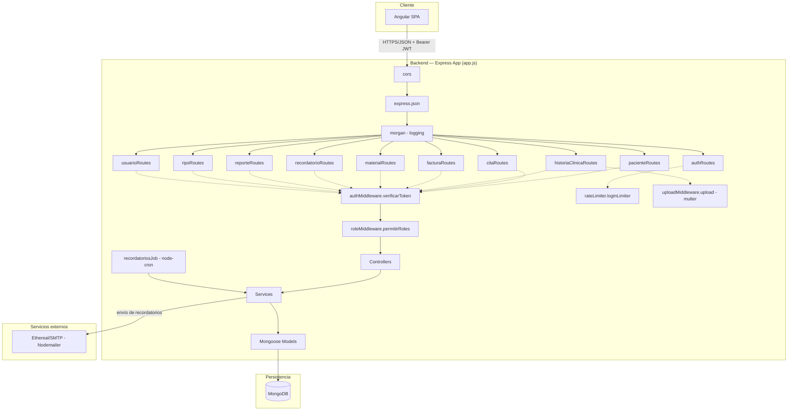
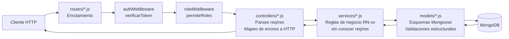

# SERVICIO NACIONAL DE APRENDIZAJE — SENA

**Etapa Productiva — Modalidad Proyecto Productivo**

*Competencia Técnica: Análisis y Desarrollo de Software*

---

# Arquitectura del Backend (Node.js + Express) y API REST

**Proyecto:** OdontoSoft — Sistema de Gestión Clínica Odontológica

**Cliente:** Consultorio Odontológico Dra. EM (Bogotá D.C.)

**Aprendiz:** `[NOMBRE COMPLETO DEL APRENDIZ]`

**Ficha SENA:** `[NÚMERO DE FICHA]`

**Instructor:** `[NOMBRE DEL INSTRUCTOR]`

**Fecha de entrega:** `[FECHA]`

---

## Contenido

1. Introducción
2. Diagrama de Componentes del Backend
3. Diagrama de Arquitectura (Rutas → Controladores → Servicios → Modelos)
4. Definición y Documentación de Endpoints de la API REST
5. Formato Estándar de Respuestas JSON
6. Integración de MongoDB con el Backend (Mongoose)

---

## 1. Introducción

El backend de OdontoSoft es una **API REST** construida en **Node.js 20 + Express 5**, organizada bajo el patrón **Rutas → Middlewares → Controladores → Servicios → Modelos** (variante de MVC adaptada a APIs sin vistas server-side). Este documento detalla su composición en componentes, cada endpoint expuesto y la forma en que Mongoose integra la aplicación con MongoDB.

---

## 2. Diagrama de Componentes del Backend



**Componentes principales:**

| Componente | Archivo | Función |
|---|---|---|
| `app.js` | `backend/src/app.js` | Ensambla middlewares globales y monta las 10 rutas bajo `/api/*` |
| `server.js` | `backend/src/server.js` | Punto de entrada: conecta a MongoDB, levanta el servidor HTTP en `PORT`, inicia el cron job |
| `config/db.js` | `backend/src/config/db.js` | Conexión a MongoDB vía Mongoose (`MONGO_URI`) |
| `jobs/recordatoriosJob.js` | — | Tarea programada (cron `0 * * * *`, cada hora) que ejecuta el envío automático de recordatorios |
| `middlewares/` | 4 archivos | `authMiddleware` (JWT), `roleMiddleware` (RBAC), `rateLimiter` (fuerza bruta en login), `uploadMiddleware` (multer, adjuntos clínicos) |

---

## 3. Diagrama de Arquitectura (Rutas → Controladores → Servicios → Modelos)



Este es el mismo patrón documentado en detalle (con pseudocódigo) en el documento **5 — Lógica de Programación y Estructura Funcional**. Aquí se enfatiza su rol como **arquitectura de componentes de API REST**: cada capa es un módulo Node.js independiente (`require`/`module.exports`), sin acoplamiento circular, lo que permite sustituir, por ejemplo, MongoDB por otro motor sin tocar `controllers/` ni `routes/`.

---

## 4. Definición y Documentación de Endpoints de la API REST

Todos los endpoints (salvo `POST /api/auth/login` y `GET /api/health`) requieren el encabezado `Authorization: Bearer <token>`. La columna **Rol** indica los roles autorizados según `permitirRoles(...)` definido en cada ruta.

### 4.1 `/api/auth` — Autenticación

| Método | Endpoint | Rol | Descripción |
|---|---|---|---|
| `POST` | `/api/auth/login` | Público (rate-limited: 5/15min por IP) | Inicia sesión, retorna JWT |
| `POST` | `/api/auth/logout` | Autenticado | Invalida el token actual (blacklist) |
| `GET` | `/api/auth/perfil` | Autenticado | Retorna el payload del usuario autenticado |
| `GET` | `/api/auth/solo-admin` | `ADMIN` | Endpoint de prueba de RBAC |

**Ejemplo — `POST /api/auth/login`:**

Request:
```json
{ "email": "dra.em@consultorio.com", "password": "Clinica2026*" }
```

Response `200 OK`:
```json
{
  "mensaje": "Login exitoso",
  "token": "eyJhbGciOiJIUzI1NiIsInR5cCI6IkpXVCJ9...",
  "usuario": { "_id": "66a1f0c2...", "nombre": "Dra. EM", "email": "dra.em@consultorio.com", "rol": "ODONTOLOGO", "estado": "ACTIVO" }
}
```

Response `401 Unauthorized`:
```json
{ "mensaje": "Credenciales inválidas" }
```

### 4.2 `/api/pacientes` — Gestión de Pacientes

| Método | Endpoint | Rol | Descripción |
|---|---|---|---|
| `POST` | `/api/pacientes` | `ADMIN`, `RECEPCIONISTA` | Crea un paciente |
| `GET` | `/api/pacientes?pagina=&limite=` | Cualquier autenticado | Lista paginada de pacientes activos |
| `GET` | `/api/pacientes/buscar?q=` | Cualquier autenticado | Búsqueda por nombre/apellido/documento (insensible a tildes) |
| `GET` | `/api/pacientes/:id` | Cualquier autenticado | Detalle de un paciente |
| `PUT` | `/api/pacientes/:id` | `ADMIN`, `RECEPCIONISTA` | Actualiza datos del paciente |
| `PATCH` | `/api/pacientes/:id/desactivar` | `ADMIN`, `RECEPCIONISTA` | Baja lógica (`estado = INACTIVO`) |

**Ejemplo — `GET /api/pacientes?pagina=1&limite=10` → `200 OK`:**
```json
{
  "pacientes": [ { "_id": "66a1f100...", "nombre": "Laura", "apellido": "Martínez", "numeroDocumento": "1020304050", "estado": "ACTIVO" } ],
  "paginacion": { "total": 1, "pagina": 1, "limite": 10, "totalPaginas": 1 }
}
```

### 4.3 `/api/citas` — Agenda de Citas

| Método | Endpoint | Rol | Descripción |
|---|---|---|---|
| `POST` | `/api/citas` | `RECEPCIONISTA` | Crea una cita (valida conflicto de horario) |
| `GET` | `/api/citas?desde=&hasta=` | Cualquier autenticado | Lista citas en un rango de fechas |
| `GET` | `/api/citas/hoy` | Cualquier autenticado | Citas del día actual |
| `GET` | `/api/citas/:id` | Cualquier autenticado | Detalle de una cita |
| `PUT` | `/api/citas/:id` | `RECEPCIONISTA` | Edita una cita (revalida conflicto si cambia horario) |
| `PATCH` | `/api/citas/:id/estado` | `RECEPCIONISTA`, `ODONTOLOGO` | Cambia el estado (`PROGRAMADA`→`CONFIRMADA`→`EN_ATENCION`→`FINALIZADA`, etc.) |
| `PATCH` | `/api/citas/:id/cancelar` | `RECEPCIONISTA` | Cancela la cita |

**Ejemplo — `POST /api/citas` con conflicto → `409 Conflict`:**
```json
{ "mensaje": "El odontólogo ya tiene una cita programada en ese horario" }
```

### 4.4 `/api/historias-clinicas` — Historia Clínica y Odontograma

| Método | Endpoint | Rol | Descripción |
|---|---|---|---|
| `POST` | `/api/historias-clinicas` | `ODONTOLOGO` | Crea la historia clínica de un paciente |
| `GET` | `/api/historias-clinicas/paciente/:pacienteId` | `ADMIN`, `ODONTOLOGO` | Obtiene la historia completa |
| `PATCH` | `/api/historias-clinicas/paciente/:pacienteId/odontograma/:numeroDiente` | `ODONTOLOGO` | Actualiza estado/observaciones de un diente |
| `POST` | `/api/historias-clinicas/paciente/:pacienteId/evoluciones` | `ODONTOLOGO` | Agrega una evolución clínica |
| `PATCH` | `/api/historias-clinicas/paciente/:pacienteId/antecedentes` | `ODONTOLOGO` | Actualiza antecedentes médicos |
| `PATCH` | `/api/historias-clinicas/paciente/:pacienteId/evoluciones/:evolucionId/desactivar` | `ADMIN` | Desactiva (nunca edita) una evolución |
| `POST` | `/api/historias-clinicas/paciente/:pacienteId/adjuntos` | `ODONTOLOGO` | Sube un adjunto (multipart/form-data, campo `archivo`) |

> Nota de diseño (RN-03/RN-10, verificada en las rutas): `RECEPCIONISTA` no tiene ningún endpoint de este módulo autorizado; `ADMIN` solo puede desactivar evoluciones, nunca crearlas ni editarlas.

### 4.5 `/api/facturas` — Facturación

| Método | Endpoint | Rol | Descripción |
|---|---|---|---|
| `GET` | `/api/facturas/tratamientos-facturables/:pacienteId` | `RECEPCIONISTA` | Tratamientos de la historia clínica listos para facturar |
| `POST` | `/api/facturas` | `RECEPCIONISTA` | Emite una factura |
| `GET` | `/api/facturas/paciente/:pacienteId` | `ADMIN`, `ODONTOLOGO`, `RECEPCIONISTA` | Historial de facturas del paciente |
| `PATCH` | `/api/facturas/:id/pagar` | `RECEPCIONISTA` | Registra un abono/pago |
| `PATCH` | `/api/facturas/:id/anular` | `RECEPCIONISTA` | Anula la factura (requiere motivo) |
| `GET` | `/api/facturas/:id/pdf` | `ADMIN`, `ODONTOLOGO`, `RECEPCIONISTA` | Descarga el PDF de la factura (`application/pdf`) |

**Ejemplo — `PATCH /api/facturas/:id/pagar`:**

Request:
```json
{ "monto": 100000, "metodoPago": "EFECTIVO" }
```

Response `200 OK`:
```json
{ "mensaje": "Pago registrado exitosamente", "factura": { "_id": "66a200bb...", "saldoPendiente": 20000, "estado": "PENDIENTE", "pagos": [ { "monto": 100000, "metodoPago": "EFECTIVO" } ] } }
```

Response `409 Conflict` (sobrepago):
```json
{ "mensaje": "El monto del abono ($300000) no puede superar el saldo pendiente ($250000)" }
```

### 4.6 `/api/materiales` — Inventario

| Método | Endpoint | Rol | Descripción |
|---|---|---|---|
| `POST` | `/api/materiales` | `RECEPCIONISTA` | Crea un material |
| `GET` | `/api/materiales` | `ADMIN`, `RECEPCIONISTA` | Lista materiales activos (incluye bandera `stockBajo`) |
| `PATCH` | `/api/materiales/:id/entrada` | `RECEPCIONISTA` | Registra entrada de stock |
| `PATCH` | `/api/materiales/:id/salida` | `RECEPCIONISTA` | Registra salida de stock (valida disponibilidad) |
| `PUT` | `/api/materiales/:id` | `RECEPCIONISTA` | Actualiza datos del material (no stock directo) |

### 4.7 `/api/recordatorios` — Recordatorios Automáticos

| Método | Endpoint | Rol | Descripción |
|---|---|---|---|
| `GET` | `/api/recordatorios/configuracion` | `ADMIN`, `RECEPCIONISTA` | Consulta la plantilla de mensaje |
| `PUT` | `/api/recordatorios/configuracion` | `RECEPCIONISTA` | Actualiza la plantilla |
| `POST` | `/api/recordatorios/ejecutar` | `RECEPCIONISTA` | Dispara manualmente el envío (además del cron automático) |
| `GET` | `/api/recordatorios` | `ADMIN`, `RECEPCIONISTA` | Lista el historial de recordatorios enviados |

### 4.8 `/api/reportes` — Reportes Gerenciales

| Método | Endpoint | Rol | Descripción |
|---|---|---|---|
| `GET` | `/api/reportes/ingresos` | `ADMIN`, `RECEPCIONISTA` | Reporte financiero de ingresos |
| `GET` | `/api/reportes/saldo-pendiente` | `ADMIN`, `RECEPCIONISTA` | Cartera pendiente de cobro |
| `GET` | `/api/reportes/pacientes-nuevos` | `ADMIN`, `RECEPCIONISTA` | Nuevos pacientes por periodo |
| `GET` | `/api/reportes/tasa-asistencia` | `ADMIN`, `RECEPCIONISTA` | % asistencia vs. inasistencia a citas |
| `GET` | `/api/reportes/tratamientos` | `ADMIN`, `ODONTOLOGO` | Procedimientos más realizados |
| `GET` | `/api/reportes/:tipo/excel` | `ADMIN`, `ODONTOLOGO`, `RECEPCIONISTA` | Exporta el reporte `:tipo` a Excel (ExcelJS) |
| `GET` | `/api/reportes/:tipo/pdf` | `ADMIN`, `ODONTOLOGO`, `RECEPCIONISTA` | Exporta el reporte `:tipo` a PDF (PDFKit) |

### 4.9 `/api/rips` — Reporte Normativo RIPS

| Método | Endpoint | Rol | Descripción |
|---|---|---|---|
| `GET` | `/api/rips/validar?periodo=AAAA-MM` | `ADMIN`, `RECEPCIONISTA` | Valida qué atenciones del periodo están completas |
| `POST` | `/api/rips/generar` | `ADMIN`, `RECEPCIONISTA` | Genera y persiste el archivo RIPS (todo-o-nada) |
| `GET` | `/api/rips/historial` | `ADMIN`, `RECEPCIONISTA` | Lista los archivos RIPS generados previamente |

### 4.10 `/api/usuarios` — Usuarios (auxiliar)

| Método | Endpoint | Rol | Descripción |
|---|---|---|---|
| `GET` | `/api/usuarios/odontologos` | `RECEPCIONISTA` | Lista odontólogos activos (para el selector al agendar citas) |

### 4.11 Endpoint de salud

| Método | Endpoint | Rol | Descripción |
|---|---|---|---|
| `GET` | `/api/health` | Público | Verifica que el servicio esté arriba (`{status:"ok", service:"OdontoSoft API"}`) — usado por la plataforma de despliegue para *health checks* |

---

## 5. Formato Estándar de Respuestas JSON

Todos los controladores siguen una convención uniforme:

- **Éxito en creación (`201`):** `{ "mensaje": "<texto>", "<recurso>": {...} }`
- **Éxito en lectura (`200`):** `{ "<recurso(s)>": [...] }` o el objeto directo para listados con paginación
- **Éxito en actualización/acción (`200`):** `{ "mensaje": "<texto>", "<recurso>": {...} }`
- **Error de validación de esquema (`400`):** `{ "mensaje": "Datos inválidos", "errores": ["mensaje 1", "mensaje 2"] }`
- **Error de negocio (`400`/`403`/`404`/`409`):** `{ "mensaje": "<texto específico>" }`, mapeado desde `error.codigo` (ver documento 6)
- **Error de ID malformado (`400`):** `{ "mensaje": "ID inválido" }` (capturado desde `error.name === 'CastError'` de Mongoose)
- **Error no controlado (`500`):** `{ "mensaje": "Error interno del servidor" }`

---

## 6. Integración de MongoDB con el Backend (Mongoose)

### 6.1 Conexión

```javascript
// backend/src/config/db.js
const mongoose = require('mongoose');

async function connectDB() {
  try {
    await mongoose.connect(process.env.MONGO_URI);
    console.log('✅ MongoDB conectado');
  } catch (err) {
    console.error('❌ Error al conectar a MongoDB:', err.message);
    process.exit(1);
  }
}
```

`server.js` invoca `connectDB()` **antes** de levantar el servidor HTTP (`app.listen`), garantizando que la aplicación nunca acepte tráfico sin conexión activa a la base de datos.

### 6.2 Patrones de definición de esquema usados en todo el proyecto

| Patrón Mongoose | Uso en OdontoSoft |
|---|---|
| `required: [true, 'mensaje']` | Validación de campos obligatorios con mensaje de error en español, devuelto tal cual al frontend |
| `enum: [...]` | Restringe valores cerrados (`rol`, `estado`, `tipoDocumento`, `metodoPago`, etc.) — rechazo automático a nivel de base de datos si un valor no pertenece al catálogo |
| `ref: 'Modelo'` + `.populate()` | Relaciones referenciadas (ej. `Cita.populate('paciente', 'nombre apellido telefono')`) — trae solo los campos necesarios del documento relacionado |
| `schema.index({...}, {unique:true})` | Restricciones de unicidad a nivel de base de datos (email de usuario, documento de paciente, cita+canal de recordatorio) |
| `{ timestamps: true }` | Genera `createdAt`/`updatedAt` automáticamente en casi todos los esquemas |
| `schema.set('toJSON', {transform: ...})` | Usado en `Usuario` para eliminar `passwordHash` de toda respuesta serializada, sin depender de que cada controlador lo recuerde hacer |
| Subdocumentos embebidos (`{_id:false}` o `{_id:true}`) | `HistoriaClinica.odontograma` (`_id:false`, no necesitan identidad propia) vs. `HistoriaClinica.adjuntos`/`evoluciones` (`_id:true`, se referencian individualmente para desactivar una evolución puntual) |
| Índice TTL (`expireAfterSeconds`) | `TokenInvalidado.expiraEn` — autolimpieza de la blacklist de JWT sin necesidad de un job adicional |
| Valor por defecto con función (`default: () => ...`) | `HistoriaClinica.odontograma` inicializa los 32 dientes automáticamente al crear el documento |

### 6.3 Ejemplo de flujo completo: de la petición HTTP al documento MongoDB

```
PATCH /api/materiales/:id/salida  { "cantidad": 8, "motivo": "Uso en procedimientos" }
   │
   ▼
materialRoutes.js → verificarToken → permitirRoles('RECEPCIONISTA') → materialController.salida
   │
   ▼
materialService.registrarSalida(id, 8, motivo, usuarioId)
   │  - Material.findById(id)            (Mongoose → MongoDB findOne)
   │  - material.movimientos.push({...}) (subdocumento embebido, en memoria)
   │  - material.stock -= 8
   │  - material.save()                  (Mongoose → MongoDB updateOne/replaceOne + validators)
   ▼
Documento persistido en la colección `materials`, con el nuevo movimiento embebido y el stock recalculado
```

Esta integración demuestra que Mongoose actúa como capa de **mapeo objeto-documento (ODM)**: los servicios manipulan instancias de JavaScript con métodos (`.save()`, `.populate()`) y Mongoose traduce esas operaciones a comandos nativos del protocolo de MongoDB (`insertOne`, `updateOne`, `find`, `$push`, `$inc`, etc.), aplicando además las validaciones del esquema antes de escribir en disco.

---

**Elaborado por:**

**Aprendiz:** `[NOMBRE COMPLETO DEL APRENDIZ]`

**Ficha SENA:** `[NÚMERO DE FICHA]`

**Fecha:** `[FECHA]`
