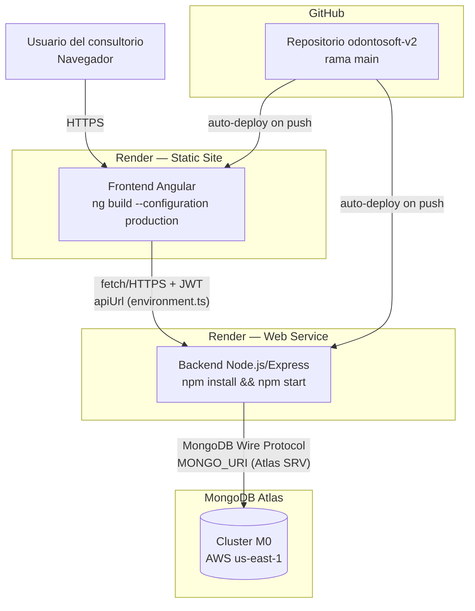
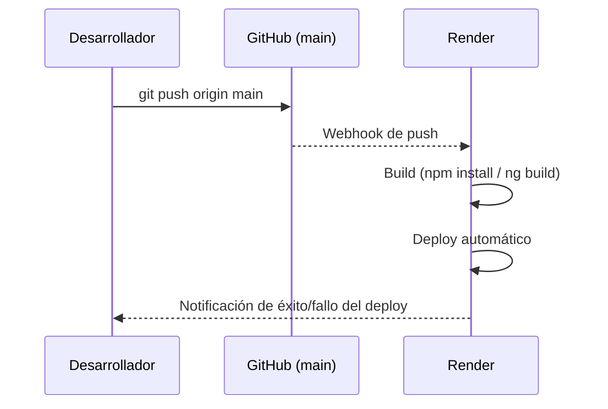

# SERVICIO NACIONAL DE APRENDIZAJE — SENA

**Etapa Productiva — Modalidad Proyecto Productivo**

*Competencia Técnica: Análisis y Desarrollo de Software*

---

# Infraestructura Cloud, Despliegue y Prácticas DevOps

**Proyecto:** OdontoSoft — Sistema de Gestión Clínica Odontológica

**Cliente:** Consultorio Odontológico Dra. EM (Bogotá D.C.)

**Aprendiz:** `[NOMBRE COMPLETO DEL APRENDIZ]`

**Ficha SENA:** `[NÚMERO DE FICHA]`

**Instructor:** `[NOMBRE DEL INSTRUCTOR]`

**Fecha de entrega:** `[FECHA]`

---

## Contenido

1. Introducción
2. Planificación de Recursos Cloud
3. Arquitectura de Despliegue
4. Evidencias del Despliegue en Producción
5. Despliegue Local con Docker (Desarrollo)
6. Configuración de Pipelines de Despliegue Continuo (CI/CD)
7. Buenas Prácticas DevOps Aplicadas

---

## 1. Introducción

Este documento describe la planificación de infraestructura, el proceso de despliegue y las prácticas DevOps adoptadas para llevar OdontoSoft de un entorno de desarrollo local a un entorno de producción accesible desde internet, manteniendo separación estricta entre configuración y código (principio de [The Twelve-Factor App](https://12factor.net/es/config)).

---

## 2. Planificación de Recursos Cloud

### 2.1 Sistemas operativos

| Entorno | Sistema operativo | Justificación |
|---|---|---|
| Desarrollo local | Cualquiera (Windows/macOS/Linux) con Node.js 20 y Docker | El proyecto no tiene dependencias nativas atadas a un SO específico |
| Contenedor de base de datos (dev) | Linux (imagen oficial `mongo:7`, Debian-based) | Imagen oficial de MongoDB, mínima superficie de mantenimiento |
| Backend en producción (Render Web Service) | Contenedor Linux administrado por la plataforma (Node.js 20 runtime) | Render provisiona y actualiza el SO subyacente; el equipo solo gestiona el `Dockerfile`/`build command` |
| Base de datos en producción | MongoDB Atlas (servicio gestionado, sin acceso directo al SO) | Elimina la responsabilidad de parchear/asegurar el sistema operativo del motor de base de datos |

### 2.2 Variables de entorno

Toda configuración sensible o dependiente del entorno se inyecta por variables de entorno — **nunca hardcodeada** en el código fuente (`backend/.env` está excluido de git vía `.gitignore`; `backend/.env.example` documenta las claves requeridas sin exponer valores reales).

| Variable | Usada en | Propósito | Ejemplo (desarrollo) |
|---|---|---|---|
| `PORT` | `server.js` | Puerto TCP en el que Express escucha | `3000` |
| `MONGO_URI` | `config/db.js` | Cadena de conexión a MongoDB (local o Atlas) | `mongodb://localhost:27017/odontosoft` |
| `JWT_SECRET` | `tokenService.js`, `authMiddleware.js` | Clave simétrica para firmar/verificar JWT | `(cadena aleatoria larga, nunca commiteada)` |
| `JWT_EXPIRES_IN` | `tokenService.js` | Tiempo de vida del token | `8h` |
| `SEED_ADMIN_PASSWORD` | `scripts/seedAdmin.js` | Password inicial del admin sembrado | `(secreto, definido por entorno)` |
| `SEED_ODONTOLOGO_PASSWORD` / `SEED_RECEPCIONISTA_PASSWORD` | `scripts/seedRoles.js` | Passwords de usuarios de prueba | `(secreto)` |
| `ETHEREAL_USER` / `ETHEREAL_PASS` | `recordatorioService.js` | Credenciales SMTP de pruebas (Ethereal) para envío de recordatorios por email | `(credenciales de buzón de pruebas)` |

**Regla aplicada:** ninguna de estas variables tiene un valor por defecto inseguro que sobreviva en producción; `JWT_SECRET` y las contraseñas de *seed* deben definirse explícitamente en la plataforma de despliegue.

### 2.3 Puertos de red

| Servicio | Puerto | Entorno | Exposición |
|---|---|---|---|
| Backend Express | `3000` (configurable vía `PORT`) | Local / contenedor | Interno; en Render se expone tras HTTPS 443 gestionado por la plataforma |
| Frontend Angular (`ng serve`) | `4200` | Desarrollo local | Local únicamente |
| Frontend (build estático) | `443` (HTTPS) | Producción | Servido como *Static Site* detrás del CDN/proxy de la plataforma |
| MongoDB | `27017` | Local / Docker (`docker-compose.yml`) | Interno (bind a `localhost` o red del contenedor); en Atlas el acceso se restringe por IP-Allowlist, no por exposición directa del puerto |

### 2.4 Dimensionamiento de recursos (nivel gratuito / bajo costo, adecuado para un consultorio independiente)

| Recurso | Nivel | Justificación |
|---|---|---|
| Backend (Render Web Service) | Free/Starter tier | Bajo volumen esperado de un consultorio con 1-3 usuarios concurrentes |
| Base de datos (MongoDB Atlas) | Cluster **M0** (gratuito, 512 MB) | Suficiente para el volumen de datos clínicos de un consultorio pequeño en su fase inicial; escalable a M2/M5 sin cambios de código si el volumen crece |
| Frontend (Render Static Site) | Free tier | Contenido estático servido vía CDN, sin cómputo del lado del servidor |

---

## 3. Arquitectura de Despliegue



**Componentes desplegados de forma independiente:** el frontend (sitio estático) y el backend (servicio web) se despliegan como dos servicios separados en la misma plataforma, cada uno con su propio ciclo de build/deploy, lo que permite actualizar uno sin afectar al otro.

---

## 4. Evidencias del Despliegue en Producción

### 4.1 Backend — Render Web Service

| Configuración | Valor |
|---|---|
| Plataforma | Render (Web Service) |
| Root Directory | `backend` |
| Build Command | `npm install` |
| Start Command | `npm start` (ejecuta `node src/server.js`) |
| Health check | `GET /api/health` → `{"status":"ok","service":"OdontoSoft API"}` |
| Variables de entorno configuradas | `PORT`, `MONGO_URI`, `JWT_SECRET`, `JWT_EXPIRES_IN`, `ETHEREAL_USER`, `ETHEREAL_PASS` (ver sección 2.2) |

📸 **Evidencia — Dashboard de Render mostrando el servicio backend en estado "Live":** `[INSERTAR CAPTURA DE PANTALLA]`

📸 **Evidencia — Respuesta del endpoint de salud en producción (`curl` o navegador):** `[INSERTAR CAPTURA DE PANTALLA]`

```bash
curl https://<url-backend-en-produccion>/api/health
# Respuesta esperada: {"status":"ok","service":"OdontoSoft API"}
```

### 4.2 Frontend — Render Static Site

| Configuración | Valor |
|---|---|
| Plataforma | Render (Static Site) |
| Root Directory | `frontend` |
| Build Command | `npm install && ng build --configuration production` |
| Publish Directory | `dist/frontend/browser` (Angular 21 con builder basado en esbuild genera la salida bajo `/browser`) |
| Regla de reescritura SPA | `/*` → `/index.html` (necesaria para el enrutamiento de Angular Router) |

📸 **Evidencia — Dashboard de Render mostrando el sitio estático desplegado:** `[INSERTAR CAPTURA DE PANTALLA]`

📸 **Evidencia — Aplicación cargando en el navegador desde la URL pública:** `[INSERTAR CAPTURA DE PANTALLA]`

### 4.3 Base de datos — MongoDB Atlas

| Configuración | Valor |
|---|---|
| Plataforma | MongoDB Atlas |
| Tipo de cluster | M0 (Shared, gratuito) |
| Región | AWS (región más cercana a Colombia disponible en el tier gratuito) |
| Acceso de red | IP Access List (se agrega `0.0.0.0/0` solo si la plataforma de hosting usa IPs dinámicas, o las IPs salientes fijas de Render si están disponibles en el plan) |
| Usuario de base de datos | Usuario dedicado a la aplicación con rol `readWrite` restringido a la base `odontosoft` (no `atlasAdmin`) |

📸 **Evidencia — Dashboard de Atlas mostrando el cluster activo y sus colecciones:** `[INSERTAR CAPTURA DE PANTALLA]`

📸 **Evidencia — Conexión exitosa desde el backend desplegado (log `✅ MongoDB conectado`):** `[INSERTAR CAPTURA DE PANTALLA]`

---

## 5. Despliegue Local con Docker (Desarrollo)

El repositorio incluye `docker-compose.yml` para levantar MongoDB de forma reproducible en cualquier máquina de desarrollo, sin instalar MongoDB nativamente:

```yaml
services:
  mongo:
    image: mongo:7
    container_name: odontosoft-mongo
    restart: unless-stopped
    ports:
      - "27017:27017"
    volumes:
      - mongo-data:/data/db

volumes:
  mongo-data:
```

**Comando de despliegue local:**

```bash
docker-compose up -d
```

**Verificación:**

```bash
docker ps            # el contenedor odontosoft-mongo debe aparecer como "Up"
docker logs odontosoft-mongo
```

El volumen nombrado `mongo-data` persiste los datos entre reinicios del contenedor, evitando pérdida de información de prueba durante el desarrollo.

---

## 6. Configuración de Pipelines de Despliegue Continuo (CI/CD)

### 6.1 Estado actual: Despliegue Continuo (CD) vía integración GitHub–Render

Render está conectado directamente al repositorio de GitHub (`main`), de modo que **cada `git push` a la rama principal dispara automáticamente** un nuevo build y despliegue tanto del backend como del frontend, sin intervención manual. Esto constituye una forma real de **Despliegue Continuo (Continuous Deployment)**:



### 6.2 Propuesta de Integración Continua (CI) previa al despliegue

Para robustecer el flujo actual (que despliega directamente sin ejecutar pruebas automatizadas antes), se documenta a continuación un flujo de trabajo de **GitHub Actions** recomendado como siguiente paso de madurez DevOps. Este archivo puede agregarse en `.github/workflows/ci.yml`:

```yaml
name: CI

on:
  push:
    branches: [main]
  pull_request:
    branches: [main]

jobs:
  backend:
    runs-on: ubuntu-latest
    defaults:
      run:
        working-directory: backend
    steps:
      - uses: actions/checkout@v4
      - uses: actions/setup-node@v4
        with:
          node-version: '20'
          cache: 'npm'
          cache-dependency-path: backend/package-lock.json
      - run: npm ci
      - run: npm test --if-present

  frontend:
    runs-on: ubuntu-latest
    defaults:
      run:
        working-directory: frontend
    steps:
      - uses: actions/checkout@v4
      - uses: actions/setup-node@v4
        with:
          node-version: '20'
          cache: 'npm'
          cache-dependency-path: frontend/package-lock.json
      - run: npm ci
      - run: npm test -- --watch=false
      - run: npm run build
```

**Efecto esperado al incorporarlo:** Render seguiría gestionando el **despliegue** (CD), pero GitHub Actions ejecutaría **pruebas automatizadas e instalación limpia de dependencias (`npm ci`)** en cada Pull Request, bloqueando visualmente (check ✅/❌ en GitHub) la fusión de cambios que rompan el build o los tests, antes de que lleguen a `main` y disparen el despliegue automático.

📸 **Evidencia (si se implementa):** captura del check de GitHub Actions en un Pull Request — `[INSERTAR CAPTURA DE PANTALLA]`

---

## 7. Buenas Prácticas DevOps Aplicadas

- **Separación config/código (12-Factor):** ningún secreto (`JWT_SECRET`, credenciales SMTP, cadena de conexión) está en el código fuente; todo vive en variables de entorno de la plataforma.
- **Idempotencia en scripts de arranque:** `seedAdmin.js` y `seedRoles.js` verifican existencia antes de crear (`findOne` previo), permitiendo ejecutarlos repetidamente sin duplicar datos, algo deseable si se re-ejecutan como parte de un pipeline.
- **Observabilidad mínima:** `morgan('dev')` registra cada petición HTTP en los logs del servicio, consultables desde el dashboard de Render para depuración en producción.
- **Endpoint de salud dedicado (`/api/health`):** permite que la plataforma cloud reinicie automáticamente el servicio si deja de responder, sin depender de un endpoint de negocio para ese chequeo.
- **Autolimpieza de datos transitorios:** el índice TTL de `TokenInvalidado` evita que la colección de tokens invalidados crezca indefinidamente, sin necesidad de un job de limpieza adicional en el pipeline de mantenimiento.
- **Despliegue desacoplado por servicio:** un cambio únicamente en el frontend no fuerza un redeploy del backend (y viceversa), reduciendo el radio de impacto y el tiempo de cada despliegue.

---

**Elaborado por:**

**Aprendiz:** `[NOMBRE COMPLETO DEL APRENDIZ]`

**Ficha SENA:** `[NÚMERO DE FICHA]`

**Fecha:** `[FECHA]`
