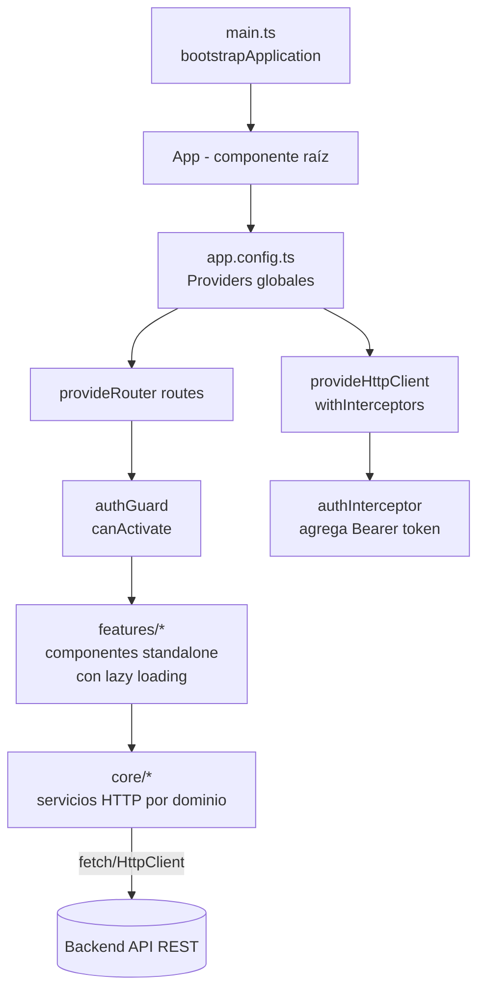
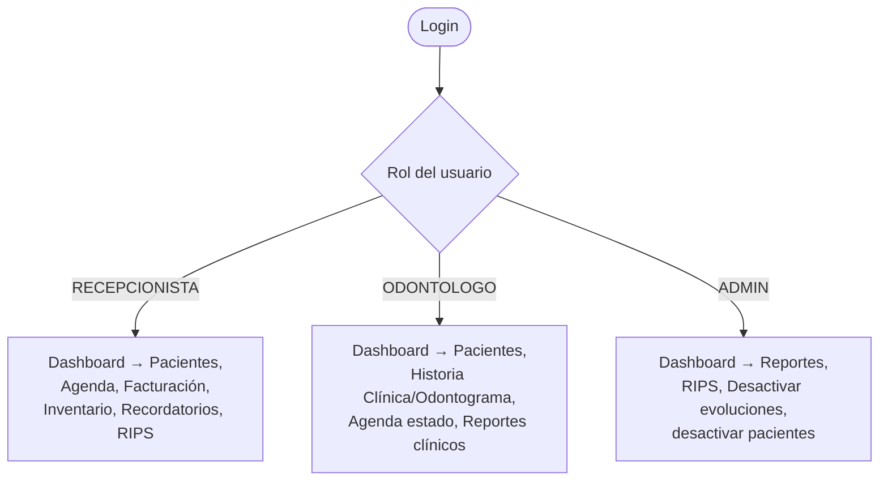

# SERVICIO NACIONAL DE APRENDIZAJE — SENA

**Etapa Productiva — Modalidad Proyecto Productivo**

*Competencia Técnica: Análisis y Desarrollo de Software*

---

# DESARROLLO DEL FRONTEND (ANGULAR) E INFORME FINAL DE ENTREGA

**Proyecto:** OdontoSoft — Sistema de Gestión Clínica Odontológica

**Cliente:** Consultorio Odontológico Dra. EM (Bogotá D.C.)

**Aprendices:** Juan Carlos Garces Sierra, Juan Pablo Mendez Gil

**Ficha SENA:** 3186265

**Instructor:** Nelson Armando Serrano Hincapie

**Fecha de entrega:** Agosto 2026

---

## CONTENIDO

1. Introducción
2. Arquitectura del Frontend
3. Nota Técnica: Sistema de Estilos (Materialize vs. Implementación Actual)
4. Estructura de Componentes y Enrutamiento
5. Capa de Comunicación con el Backend (Servicios HTTP, Guard, Interceptor)
6. Flujo de Navegación por Rol
7. Informe Final de Entrega del Proyecto

---

## 1. INTRODUCCIÓN

Este documento cierra la serie de documentación técnica de OdontoSoft (documentos 5 al 12) describiendo la implementación del **frontend en Angular** y presentando el **informe final de entrega** del proyecto en su conjunto: alcance cubierto, artefactos producidos, estado de las pruebas y del despliegue, y trabajo pendiente.

---

## 2. ARQUITECTURA DEL FRONTEND

**Stack real implementado:** Angular 21 (standalone components, sin `NgModule`), TypeScript 5.9, `provideHttpClient` con interceptores funcionales, `provideRouter` con *lazy loading* por ruta, Vitest + jsdom para pruebas unitarias.



**Organización de carpetas (`frontend/src/app/`):**

| Carpeta | Contenido |
|---|---|
| `core/` | Servicios HTTP por dominio (`auth.ts`, `paciente.ts`, `cita.ts`, `historia-clinica.ts`, `factura.ts`, `material.ts`, `recordatorio.ts`, `reporte.ts`, `rips.ts`, `usuario.ts`), más el guard (`auth-guard.ts`) y el interceptor (`auth-interceptor.ts`) transversales a toda la aplicación |
| `features/` | Un subdirectorio por módulo funcional (`login`, `dashboard`, `pacientes`, `citas`, `historia-clinica`, `facturacion`, `inventario`, `recordatorios`, `reportes`, `rips`), cada uno con sus propios componentes standalone |
| `app.routes.ts` | Tabla de rutas con *lazy loading* (`loadComponent`) y protección (`canActivate: [authGuard]`) |
| `app.config.ts` | *Providers* globales: enrutador, cliente HTTP con interceptor de autenticación |

---

## 3. NOTA TÉCNICA: DECISIÓN DE NO USAR MATERIALIZE — ALTERNATIVA ADOPTADA Y JUSTIFICACIÓN

El requerimiento original del proyecto formativo contemplaba **Angular + Materialize** como stack de frontend. Durante la implementación se tomó la decisión técnica de **no usar Materialize** y adoptar en su lugar **SCSS propio por componente**, aprovechando la encapsulación de estilos nativa de Angular (`ViewEncapsulation.Emulated`). Esta sección deja constancia formal de esa decisión y de las razones que la motivaron, para trazabilidad entre lo *requerido en el enunciado original* y lo *efectivamente implementado*.

### 3.1 Verificación en el código fuente

- **No existe dependencia de Materialize** en `frontend/package.json` (ni `materialize-css`, ni `@materializecss/materialize`, ni el wrapper `angular2-materialize`).
- El archivo global `frontend/src/styles.scss` está vacío (solo el placeholder que genera Angular CLI); cada componente trae su propio archivo `*.scss` con clases de dominio propio (ej. `login-container`, `login-form`, `campo`, `error-campo` en `features/login/login.html`), en vez de las clases utilitarias de Materialize (`input-field`, `card-panel`, `btn`, `waves-effect`, etc.).

### 3.2 Razones de la decisión

1. **Incompatibilidad arquitectónica con Angular standalone moderno.** Materialize es una librería CSS/JS pensada para manipulación directa del DOM (jQuery o vanilla JS con inicialización manual de componentes como modales, `select`, `datepicker`, `collapsible`). Esto entra en conflicto con el modelo de renderizado declarativo de Angular (change detection, `@if`/`@for`, standalone components): cada vez que Angular re-renderiza un nodo, los widgets de Materialize inicializados sobre ese nodo quedan "huérfanos" y hay que reinicializarlos manualmente (`M.AutoInit()` o similar) después de cada ciclo de detección de cambios, lo que introduce acoplamiento frágil entre el ciclo de vida de Angular y el de Materialize.
2. **Mantenimiento y compatibilidad con Angular 21.** Materialize CSS (proyecto original) lleva varios años sin una versión mayor estable; no existe un paquete oficial de integración para Angular con soporte activo para *standalone components* ni para las versiones recientes de Angular (15+). Adoptar una librería con ese riesgo de obsolescencia va en contra del principio de mantenibilidad a largo plazo (RNF de mantenibilidad del SRS).
3. **Peso y control del bundle.** Materialize se distribuye como un bundle CSS/JS monolítico que no se puede *tree-shakear* por componente. El enfoque de SCSS por componente permite que Angular (vía `@angular/build`, basado en esbuild) incluya en cada *chunk* lazy-loaded únicamente el CSS que ese componente realmente usa, alineado con la estrategia de *lazy loading* por ruta ya documentada en la sección 4.
4. **Encapsulación de estilos nativa vs. clases globales.** Materialize funciona con clases CSS globales que se aplican en toda la aplicación (riesgo de colisión de nombres y de "fugas" de estilo entre módulos). La encapsulación de vista de Angular (`ViewEncapsulation.Emulated`, por defecto) confina el CSS de cada componente a su propio árbol DOM, evitando ese riesgo sin necesidad de convenciones adicionales (BEM, prefijos, etc.).
5. **Ajuste al dominio clínico del proyecto.** El lenguaje visual de Materialize sigue estrictamente Material Design (Google), lo cual no necesariamente refleja la identidad visual requerida para un consultorio odontológico (paleta, densidad de información en tablas clínicas, presentación del odontograma). Un sistema de estilos propio permite ajustar exactamente la interfaz a esas necesidades sin pelear contra las convenciones visuales por defecto de una librería de terceros.

### 3.3 Alternativa adoptada

**SCSS por componente, sin librería de UI de terceros**, apoyado en las capacidades nativas de Angular:

| Necesidad que cubría Materialize | Solución adoptada en su lugar |
|---|---|
| Sistema de grid/layout | Flexbox/CSS Grid nativo en cada `*.scss` de componente |
| Componentes de formulario estilizados (`input-field`) | Clases propias (`campo`, `error-campo`) + validación reactiva de Angular Forms |
| Encapsulación de estilos | `ViewEncapsulation.Emulated` (comportamiento por defecto de Angular, sin configuración adicional) |
| Consistencia visual entre módulos | Convención de nomenclatura de clases por componente (sin variables de diseño centralizadas aún — ver pendiente 7.4) |

Esta decisión queda documentada como **definitiva para la versión actual del proyecto** (no como algo pendiente de resolver), sin perjuicio de que una futura iteración evalúe introducir un sistema de diseño (propio o de terceros) si el crecimiento de la aplicación lo justifica.

---

## 4. ESTRUCTURA DE COMPONENTES Y ENRUTAMIENTO

Todas las rutas (excepto `/login`) están protegidas por `authGuard`, que verifica localmente si existe un token válido antes de permitir la navegación (defensa de primera línea; la autorización real y definitiva ocurre siempre en el backend vía `verificarToken` + `permitirRoles`).

| Ruta | Componente (standalone) | Módulo funcional |
|---|---|---|
| `/login` | `Login` | Autenticación |
| `/dashboard` | `Dashboard` | Panel principal |
| `/pacientes`, `/pacientes/nuevo`, `/pacientes/:id`, `/pacientes/:id/editar` | `ListaPacientes`, `FormPaciente`, `DetallePaciente` | Pacientes |
| `/citas`, `/citas/nueva`, `/citas/:id/editar` | `Agenda`, `FormCita` | Citas |
| `/pacientes/:pacienteId/historia-clinica` | `VistaHistoria` | Historia Clínica |
| `/pacientes/:pacienteId/facturacion`, `/pacientes/:pacienteId/facturacion/nueva` | `ListaFacturas`, `FormFactura` | Facturación |
| `/inventario`, `/inventario/nuevo`, `/inventario/:id`, `/inventario/:id/editar` | `ListaMateriales`, `FormMaterial`, `DetalleMaterial` | Inventario |
| `/recordatorios`, `/recordatorios/historial` | `ConfigMensaje`, `HistorialRecordatorios` | Recordatorios |
| `/reportes`, `/reportes/clinicos` | `DashboardReportes`, `ReporteClinico` | Reportes |
| `/rips`, `/rips/historial` | `ValidacionPeriodoComponent`, `HistorialRips` | RIPS |

**Patrón aplicado:** cada ruta usa `loadComponent` (carga perezosa a nivel de componente, no de módulo — patrón moderno de Angular standalone), de modo que el usuario solo descarga el código JavaScript del módulo funcional que efectivamente visita, reduciendo el tamaño del bundle inicial.

---

## 5. CAPA DE COMUNICACIÓN CON EL BACKEND (SERVICIOS HTTP, GUARD, INTERCEPTOR)

### 5.1 Interceptor de autenticación (`core/auth-interceptor.ts`)

```typescript
export const authInterceptor: HttpInterceptorFn = (req, next) => {
  const authService = inject(AuthService);
  const token = authService.getToken();

  if (token) {
    const cloned = req.clone({ setHeaders: { Authorization: `Bearer ${token}` } });
    return next(cloned);
  }
  return next(req);
};
```

Adjunta automáticamente el `Bearer <token>` a **toda** petición HTTP saliente, centralizando esta responsabilidad en un solo lugar en vez de repetirla en cada servicio (`paciente.ts`, `cita.ts`, etc.).

### 5.2 Guard de rutas (`core/auth-guard.ts`)

```typescript
export const authGuard: CanActivateFn = () => {
  const authService = inject(AuthService);
  const router = inject(Router);

  if (authService.estaAutenticado()) return true;

  router.navigate(['/login']);
  return false;
};
```

Redirige a `/login` cualquier intento de acceso directo por URL a una ruta protegida sin sesión activa — complementa (no reemplaza) la validación de rol que hace el backend en cada endpoint.

### 5.3 Servicios por dominio

Cada colección/módulo del backend tiene su espejo en `core/` (`paciente.ts`, `cita.ts`, `factura.ts`, `historia-clinica.ts`, `material.ts`, `recordatorio.ts`, `reporte.ts`, `rips.ts`, `usuario.ts`), encapsulando las llamadas `HttpClient` a los endpoints documentados en el documento 10. Esta correspondencia 1:1 entre servicio de frontend y módulo de backend facilita ubicar rápidamente qué componente consume qué endpoint.

---

## 6. FLUJO DE NAVEGACIÓN POR ROL



El frontend **no oculta de forma exhaustiva** cada botón por rol en todos los casos (esto se valida principalmente en backend); las vistas condicionan la navegación principal por rol, pero la autorización de datos siempre depende del `HTTP 403` que retorne la API si un rol intenta un endpoint no permitido (defensa en profundidad, documentada en el documento 6, sección 3).

---

## 7. INFORME FINAL DE ENTREGA DEL PROYECTO

### 7.1 Resumen ejecutivo

**OdontoSoft** es un sistema de gestión clínica odontológica implementado como aplicación web MEAN-like (MongoDB + Express + Angular + Node.js), desarrollado a partir del levantamiento de requisitos con la Dra. EM para digitalizar la operación administrativa, clínica y financiera de su consultorio. El proyecto cubre 9 módulos funcionales de negocio y su documentación técnica completa se compone de 12 documentos.

### 7.2 Documentación técnica producida

| # | Documento | Contenido |
|---|---|---|
| 1 | Especificación de Requisitos de Software (SRS) | Alcance, objetivos, inicio del proyecto |
| 2 | Instrumentos de recolección de datos | Entrevistas y evidencia de levantamiento |
| 3 | Informe de Requisitos Funcionales y No Funcionales | 59 RF, 14 RNF, 10 reglas de negocio |
| 4 | Definición de Roles de Usuario (RBAC) | ADMIN, ODONTOLOGO, RECEPCIONISTA |
| 5 | Lógica de Programación y Estructura Funcional | Arquitectura en capas, módulos, convenciones |
| 6 | Entradas, Procesos y Salidas de Funciones Críticas | E-P-S de las funciones de mayor riesgo de negocio |
| 7 | Diagramas de Flujo y Pseudocódigo | 6 algoritmos principales documentados |
| 8 | Pruebas de Escritorio Manuales | Trazas manuales de los 6 algoritmos, con casos límite |
| 9 | Modelado e Implementación de la Base de Datos | Colecciones, esquemas JSON, script de inicialización, evidencia CRUD |
| 10 | Arquitectura del Backend y API REST | Componentes, 10 grupos de endpoints documentados, integración Mongoose |
| 11 | Infraestructura Cloud, Despliegue y DevOps | Recursos cloud, variables de entorno, despliegue, CI/CD |
| 12 | Desarrollo del Frontend e Informe Final | Este documento |

Documentos 9 a 12 (Documentación_Modulo1 a Modulo9) complementan con el detalle funcional de cada módulo de negocio.

### 7.3 Estado de la implementación por capa

| Capa | Estado | Evidencia |
|---|---|---|
| Base de datos (MongoDB/Mongoose) | ✅ Implementada — 11 colecciones, esquemas con validación e índices | Documento 9 |
| Backend (Node/Express) | ✅ Implementado — 9 módulos de negocio + auth, RBAC, rate limiting, cron de recordatorios | Documento 10 |
| Frontend (Angular) | ✅ Implementado — standalone components, lazy loading, guard/interceptor funcionales | Este documento, sección 2-6 |
| Sistema de estilos | ✅ **Decisión cerrada** — se descartó Materialize; se implementó SCSS propio por componente, con justificación documentada | Sección 3 de este documento |
| Despliegue en producción | Según README del proyecto: backend y frontend en Render, base de datos en MongoDB Atlas M0 | Documento 11, sección 4 (requiere capturas de evidencia) |
| CI/CD | ✅ Despliegue continuo activo (Render + GitHub) · ⚠️ Integración continua (tests automatizados pre-deploy) propuesta, no implementada aún | Documento 11, sección 6 |

### 7.4 Pendientes identificados para el cierre formal del proyecto

1. Capturar y adjuntar las evidencias visuales marcadas como `[INSERTAR CAPTURA DE PANTALLA]` en los documentos 9 y 11 (Compass/mongosh, dashboards de Render y Atlas).
2. Si se desea formalizar la Integración Continua, crear `.github/workflows/ci.yml` con el contenido propuesto en el documento 11, sección 6.2.
3. Completar los campos de identificación (`[NOMBRE DEL APRENDIZ]`, `[FICHA]`, `[INSTRUCTOR]`, `[FECHA]`) en los 12 documentos antes de la entrega formal.
4. (Opcional, futuro) Evaluar la introducción de un sistema de diseño centralizado (variables SCSS compartidas, tokens de color/tipografía) si el número de componentes sigue creciendo — ver sección 3.3.

### 7.5 Conclusión

El sistema OdontoSoft cumple, a nivel de arquitectura e implementación, con los requisitos funcionales y no funcionales levantados con el cliente: control de acceso por roles, agenda sin conflictos de horario, facturación con trazabilidad de pagos, historia clínica con odontograma, inventario con control de stock, y generación de RIPS conforme a la normativa colombiana vigente. La documentación técnica generada (documentos 5 a 12) permite a cualquier desarrollador o evaluador externo comprender, verificar y dar mantenimiento al sistema sin depender del conocimiento tácito del equipo que lo construyó.

---

**Elaborado por:**

**Aprendices:** Juan Carlos Garces Sierra, Juan Pablo Mendez Gil

**Ficha SENA:** 3186265

**Fecha:** `[FECHA]`

---

**Firma del Cliente:**

_______________________________________

Nombre: Dra. EM

Cargo: Odontóloga fundadora — Consultorio OdontoSoft

Fecha: `[FECHA]`

---

**Firma del Aprendiz:**

_______________________________________

Nombre: `[NOMBRE COMPLETO DEL APRENDIZ]`

Ficha SENA: `[NÚMERO DE FICHA]`

Fecha: `[FECHA]`

---

**Aprobación del Instructor:**

_______________________________________

Nombre: `[NOMBRE DEL INSTRUCTOR]`

Rol: Instructor SENA — Análisis y Desarrollo de Software

Fecha: `[FECHA]`
