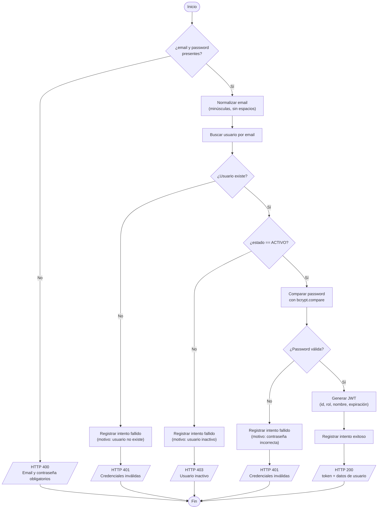
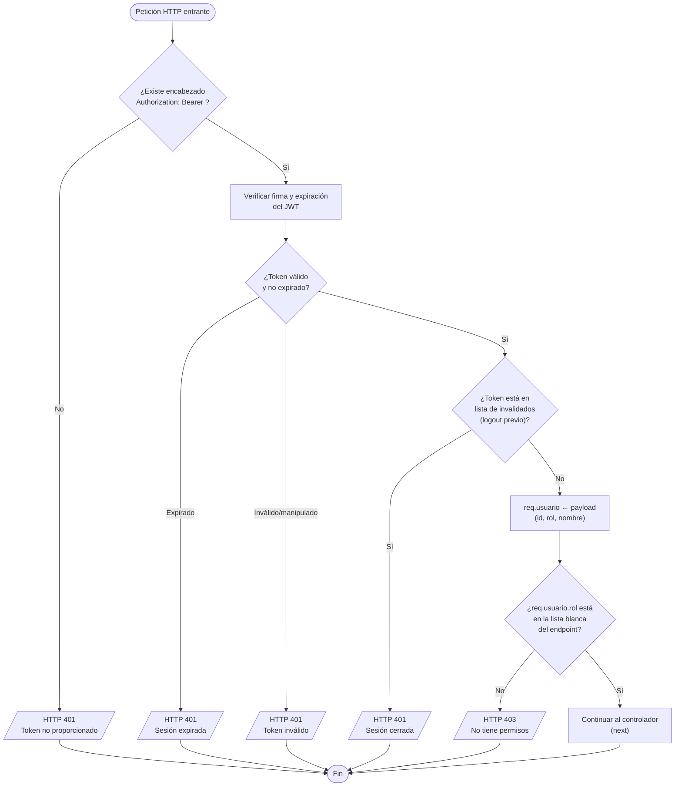
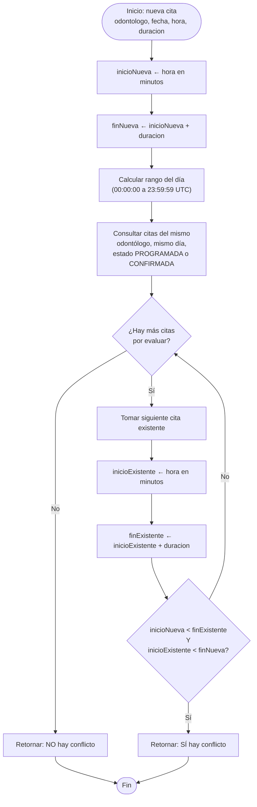
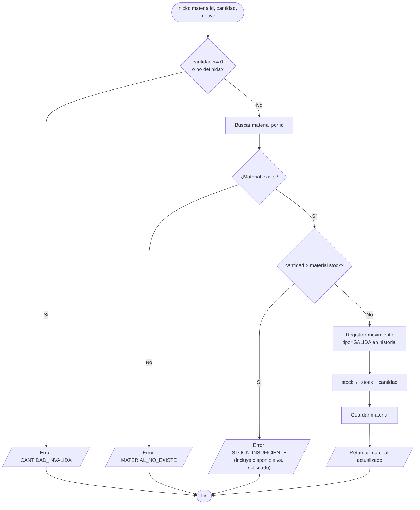
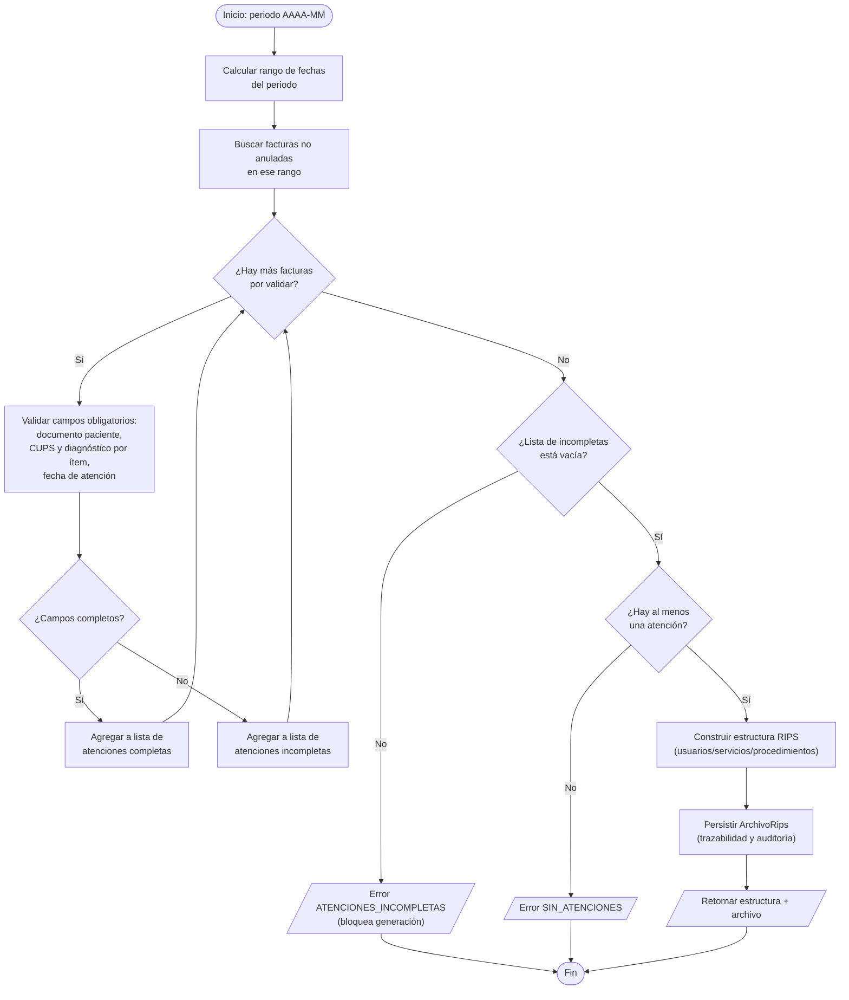

# SERVICIO NACIONAL DE APRENDIZAJE — SENA

**Etapa Productiva — Modalidad Proyecto Productivo**

*Competencia Técnica: Análisis y Desarrollo de Software*

---

# DIAGRAMAS DE FLUJO Y PSEUDOCÓDIGO DE LOS ALGORITMOS PRINCIPALES

**Proyecto:** OdontoSoft — Sistema de Gestión Clínica Odontológica

**Cliente:** Consultorio Odontológico Dra. EM (Bogotá D.C.)

**Aprendices:** Juan Carlos Garces Sierra, Juan Pablo Mendez Gil

**Ficha SENA:** 3186265

**Instructor:** Nelson Armando Serrano Hincapie

**Fecha de entrega:** Agosto 2026

---

## CONTENIDO

1. Introducción
2. Algoritmo 1 — Inicio de Sesión (Login)
3. Algoritmo 2 — Validación de Acceso por Rol (RBAC)
4. Algoritmo 3 — Detección de Conflicto de Horario en Citas
5. Algoritmo 4 — Registro de Pago y Recálculo de Saldo de Factura
6. Algoritmo 5 — Control de Salida de Inventario
7. Algoritmo 6 — Validación y Generación de Archivo RIPS

---

## 1. INTRODUCCIÓN

Este documento presenta, para cada algoritmo crítico identificado en el documento anterior, un diagrama de flujo (notación Mermaid) y su pseudocódigo equivalente. Ambas representaciones describen el mismo algoritmo implementado en el código fuente del backend, referenciado con su archivo y función.

---

## 2. ALGORITMO 1 — INICIO DE SESIÓN (LOGIN)

**Referencia:** `authController.js → login()`



**Pseudocódigo:**

```
FUNCIÓN login(email, password):
    SI email es vacío O password es vacío ENTONCES
        RETORNAR HTTP 400 "Email y contraseña son obligatorios"
    FIN SI

    emailNormalizado ← minusculas(quitarEspacios(email))
    usuario ← buscarUsuarioPorEmail(emailNormalizado)

    SI usuario NO existe ENTONCES
        registrarIntento(emailNormalizado, exito=false, motivo="usuario no existe")
        RETORNAR HTTP 401 "Credenciales inválidas"
    FIN SI

    SI usuario.estado ≠ "ACTIVO" ENTONCES
        registrarIntento(emailNormalizado, exito=false, motivo="usuario inactivo")
        RETORNAR HTTP 403 "Usuario inactivo, contacte al administrador"
    FIN SI

    passwordValida ← bcrypt.comparar(password, usuario.passwordHash)

    SI NO passwordValida ENTONCES
        registrarIntento(emailNormalizado, exito=false, motivo="contraseña incorrecta")
        RETORNAR HTTP 401 "Credenciales inválidas"
    FIN SI

    token ← generarJWT({id: usuario.id, rol: usuario.rol, nombre: usuario.nombre})
    registrarIntento(emailNormalizado, exito=true, motivo="login exitoso")

    RETORNAR HTTP 200 { mensaje: "Login exitoso", token, usuario }
FIN FUNCIÓN
```

**Nota de diseño:** los casos "usuario no existe" y "contraseña incorrecta" devuelven el **mismo mensaje genérico** al cliente ("Credenciales inválidas"), aunque internamente se registran con motivos distintos en el log de auditoría. Esto evita que un atacante pueda enumerar cuentas válidas por ensayo y error (mitigación de enumeración de usuarios).

---

## 3. ALGORITMO 2 — VALIDACIÓN DE ACCESO POR ROL (RBAC)

**Referencia:** `authMiddleware.js → verificarToken()` + `roleMiddleware.js → permitirRoles()`



**Pseudocódigo:**

```
FUNCIÓN verificarToken(peticion):
    encabezado ← peticion.headers["Authorization"]

    SI encabezado no existe O no comienza con "Bearer " ENTONCES
        RETORNAR HTTP 401 "Token no proporcionado"
    FIN SI

    token ← extraerToken(encabezado)

    INTENTAR
        payload ← jwt.verificar(token, CLAVE_SECRETA)
    CAPTURAR error
        SI error.tipo == "TokenExpirado" ENTONCES
            RETORNAR HTTP 401 "Sesión expirada, inicie sesión nuevamente"
        SINO
            RETORNAR HTTP 401 "Token inválido"
        FIN SI
    FIN INTENTAR

    SI token EXISTE EN listaDeTokensInvalidados ENTONCES
        RETORNAR HTTP 401 "Sesión cerrada, inicie sesión nuevamente"
    FIN SI

    peticion.usuario ← payload
    CONTINUAR
FIN FUNCIÓN

FUNCIÓN permitirRoles(rolesPermitidos[]):
    RETORNAR FUNCIÓN(peticion):
        SI peticion.usuario NO existe ENTONCES
            RETORNAR HTTP 401 "No autenticado"
        FIN SI

        SI peticion.usuario.rol NO ESTÁ EN rolesPermitidos ENTONCES
            RETORNAR HTTP 403 "No tiene permisos para acceder a este recurso"
        FIN SI

        CONTINUAR
    FIN FUNCIÓN
FIN FUNCIÓN
```

**Matriz de decisión aplicada por endpoint (ejemplos reales del sistema):**

| Endpoint | Roles permitidos |
|---|---|
| `POST /api/citas` (crear cita) | `RECEPCIONISTA` |
| `PATCH /api/citas/:id/estado` | `RECEPCIONISTA`, `ODONTOLOGO` |
| `POST /api/historias-clinicas` | `ODONTOLOGO` |
| `PATCH /api/historias-clinicas/.../desactivar` | `ADMIN` |
| `POST /api/facturas/:id/pagar` | `RECEPCIONISTA` |
| `GET /api/rips/generar` | `ADMIN`, `RECEPCIONISTA` |

---

## 4. ALGORITMO 3 — DETECCIÓN DE CONFLICTO DE HORARIO EN CITAS

**Referencia:** `citaService.js → existeConflictoHorario()`



**Pseudocódigo:**

```
FUNCIÓN existeConflictoHorario(odontologo, fecha, hora, duracion, citaIdExcluir):
    inicioNueva ← convertirAMinutos(hora)
    finNueva ← inicioNueva + duracion

    inicioDia ← fecha con hora 00:00:00.000 UTC
    finDia ← fecha con hora 23:59:59.999 UTC

    filtro ← {
        odontologo: odontologo,
        fecha: ENTRE inicioDia Y finDia,
        estado: EN ["PROGRAMADA", "CONFIRMADA"]
    }
    SI citaIdExcluir EXISTE ENTONCES
        filtro._id ← DISTINTO DE citaIdExcluir
    FIN SI

    citasDelDia ← buscarCitas(filtro)

    PARA CADA citaExistente EN citasDelDia HACER
        inicioExistente ← convertirAMinutos(citaExistente.hora)
        finExistente ← inicioExistente + citaExistente.duracion

        // Dos rangos se solapan si uno empieza antes de que el otro termine,
        // evaluado en ambos sentidos
        SI inicioNueva < finExistente Y inicioExistente < finNueva ENTONCES
            RETORNAR verdadero  // hay conflicto
        FIN SI
    FIN PARA

    RETORNAR falso  // no hay conflicto
FIN FUNCIÓN
```

**Prueba de solapamiento (regla matemática):** dados dos intervalos `[A_inicio, A_fin)` y `[B_inicio, B_fin)`, se solapan si y solo si `A_inicio < B_fin` **y** `B_inicio < A_fin`. Esta doble condición cubre los cuatro casos posibles (contención total, contención parcial por la izquierda, por la derecha, e igualdad de rangos).

---

## 5. ALGORITMO 4 — REGISTRO DE PAGO Y RECÁLCULO DE SALDO DE FACTURA

**Referencia:** `facturaService.js → registrarPago()`


**Pseudocódigo:**

```
FUNCIÓN registrarPago(facturaId, monto, metodoPago, usuarioId):
    SI metodoPago NO ESTÁ EN {"EFECTIVO","TRANSFERENCIA","TARJETA"} ENTONCES
        LANZAR error METODO_INVALIDO
    FIN SI

    factura ← buscarFacturaPorId(facturaId)
    SI factura NO existe ENTONCES
        LANZAR error FACTURA_NO_EXISTE
    FIN SI

    SI factura.estado == "ANULADA" ENTONCES
        LANZAR error FACTURA_ANULADA
    FIN SI

    SI monto > factura.saldoPendiente ENTONCES
        LANZAR error MONTO_EXCEDE_SALDO
    FIN SI

    factura.pagos.agregar({monto, metodoPago, registradoPor: usuarioId, fecha: ahora})

    // El saldo SIEMPRE se recalcula en el servidor, nunca se acepta del cliente
    factura.saldoPendiente ← factura.saldoPendiente − monto

    SI factura.saldoPendiente == 0 ENTONCES
        factura.estado ← "PAGADA"
    FIN SI

    guardar(factura)
    RETORNAR factura
FIN FUNCIÓN
```

---

## 6. ALGORITMO 5 — CONTROL DE SALIDA DE INVENTARIO

**Referencia:** `materialService.js → registrarSalida()`



**Pseudocódigo:**

```
FUNCIÓN registrarSalida(materialId, cantidad, motivo, usuarioId):
    SI cantidad ES NULA O cantidad <= 0 ENTONCES
        LANZAR error CANTIDAD_INVALIDA
    FIN SI

    material ← buscarMaterialPorId(materialId)
    SI material NO existe ENTONCES
        LANZAR error MATERIAL_NO_EXISTE
    FIN SI

    SI cantidad > material.stock ENTONCES
        LANZAR error STOCK_INSUFICIENTE
             ("Disponible: " + material.stock + ", solicitado: " + cantidad)
    FIN SI

    material.movimientos.agregar({
        tipo: "SALIDA", cantidad, motivo, registradoPor: usuarioId
    })

    material.stock ← material.stock − cantidad
    guardar(material)

    RETORNAR material
FIN FUNCIÓN
```

**Indicador derivado (usado en el listado):** `stockBajo ← (stock <= stockMinimo)`, calculado en `listarMateriales()` para alertar reabastecimiento sin necesidad de un campo redundante en la base de datos.

---

## 7. ALGORITMO 6 — VALIDACIÓN Y GENERACIÓN DE ARCHIVO RIPS

**Referencia:** `ripsService.js → validarCamposObligatorios()` + `generarYRegistrarRips()`



**Pseudocódigo:**

```
FUNCIÓN generarYRegistrarRips(periodo, usuarioId):
    {fechaInicio, fechaFin} ← calcularRangoPeriodo(periodo)
    facturas ← buscarFacturas(NO ANULADA, creadas ENTRE fechaInicio Y fechaFin)

    completas ← []
    incompletas ← []

    PARA CADA factura EN facturas HACER
        camposFaltantes ← validarCamposObligatorios(factura, factura.paciente)
        SI camposFaltantes ESTÁ VACÍA ENTONCES
            completas.agregar(transformarAProcedimientosRips(factura))
        SINO
            incompletas.agregar({factura.id, camposFaltantes})
        FIN SI
    FIN PARA

    // Regla normativa: el RIPS es todo-o-nada, no se generan reportes parciales
    SI incompletas NO ESTÁ VACÍA ENTONCES
        LANZAR error ATENCIONES_INCOMPLETAS (detalle: incompletas)
    FIN SI

    SI completas ESTÁ VACÍA ENTONCES
        LANZAR error SIN_ATENCIONES
    FIN SI

    estructura ← construirEstructuraRips(completas)
    archivo ← persistirArchivoRips(periodo, facturas, usuarioId)

    RETORNAR {estructura, archivo}
FIN FUNCIÓN
```
