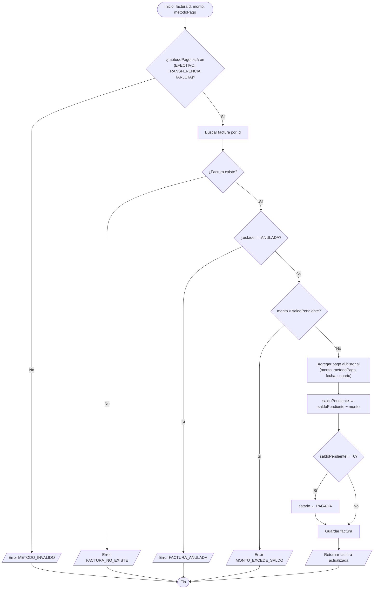

# SERVICIO NACIONAL DE APRENDIZAJE — SENA

**Etapa Productiva — Modalidad Proyecto Productivo**

*Competencia Técnica: Análisis y Desarrollo de Software*

---

# DIAGRAMAS DE FLUJO Y PSEUDOCÓDIGO DE LOS ALGORITMOS PRINCIPALES

**Proyecto:** OdontoSoft — Sistema de Gestión Clínica Odontológica

**Cliente:** Consultorio Odontológico Dra. EM (Bogotá D.C.)

**Aprendices:** Juan Carlos Garces Sierra, Juan Pablo Mendez Gil

**Ficha SENA:** 3186265

**Instructor:** Nelson Armando Serrano Hincapie

**Fecha de entrega:** Agosto 2026

---

## CONTENIDO

1. Introducción
2. Algoritmo 1 — Inicio de Sesión (Login)
3. Algoritmo 2 — Validación de Acceso por Rol (RBAC)
4. Algoritmo 3 — Detección de Conflicto de Horario en Citas
5. Algoritmo 4 — Registro de Pago y Recálculo de Saldo de Factura
6. Algoritmo 5 — Control de Salida de Inventario
7. Algoritmo 6 — Validación y Generación de Archivo RIPS

---

## 1. INTRODUCCIÓN

Este documento presenta, para cada algoritmo crítico identificado en el documento anterior, un diagrama de flujo (notación Mermaid) y su pseudocódigo equivalente, expresado en **sintaxis PSeInt**. Ambas representaciones describen el mismo algoritmo implementado en el código fuente del backend, referenciado con su archivo y función.

### 1.1 Nota sobre la adaptación a PSeInt

PSeInt es una herramienta pensada para verificar la **lógica** de un algoritmo de forma aislada; no ejecuta peticiones HTTP, no se conecta a MongoDB ni puede invocar librerías criptográficas reales (bcrypt, jsonwebtoken). Por eso, para poder trazar y ejecutar estos algoritmos dentro de PSeInt, se aplican las siguientes simplificaciones, válidas únicamente para fines de verificación lógica:

| Elemento real del sistema | Simulación en PSeInt |
|---|---|
| Consulta a MongoDB (`buscarUsuarioPorEmail`, `buscarFacturaPorId`, etc.) | Arreglos (`Dimension`) cargados al inicio del `Proceso` con datos de prueba |
| `bcrypt.comparar(password, hash)` | Comparación directa de cadenas (`password = passwordGuardada`) |
| `jwt.verificar()` / `generarJWT()` | Cadena de texto armada por concatenación, sin firma real |
| Petición HTTP y sus códigos de estado | `Leer` para la entrada y `Escribir` con el código y mensaje como salida por consola |

Cada algoritmo indica explícitamente qué partes están simuladas. El pseudocódigo usa las palabras clave estándar de PSeInt (`Proceso`/`FinProceso`, `SubProceso`/`FinSubProceso`, `Funcion`/`FinFuncion`, `Definir`, `Dimension`, `Si-Entonces-SiNo-FinSi`, `Mientras-FinMientras`, `Para-FinPara`, `Escribir`, `Leer`). Los diagramas de flujo (Mermaid) mostrados a continuación son equivalentes al diagrama DFD que PSeInt genera automáticamente con la opción **Ver → Diagrama de flujo** al pegar cada algoritmo en el editor.

---

## 2. ALGORITMO 1 — INICIO DE SESIÓN (LOGIN)

**Referencia:** `authController.js → login()`


**Simulación necesaria:** la consulta a MongoDB se reemplaza por arreglos `bdEmail/bdPasswordHash/bdEstado/bdRol/bdNombre` cargados al inicio; `bcrypt.comparar()` se reemplaza por comparación directa de cadenas; `generarJWT()` se reemplaza por una cadena armada por concatenación.

**Pseudocódigo (sintaxis PSeInt):**

```
Proceso Login
	// ---- Simulación de la base de datos de usuarios ----
	Dimension bdEmail[5] Como Cadena
	Dimension bdPasswordHash[5] Como Cadena
	Dimension bdEstado[5] Como Cadena
	Dimension bdRol[5] Como Cadena
	Dimension bdNombre[5] Como Cadena
	Definir totalUsuarios Como Entero

	totalUsuarios <- 2
	bdEmail[1] <- "dra.em@consultorio.com"
	bdPasswordHash[1] <- "Clinica2026*"
	bdEstado[1] <- "ACTIVO"
	bdRol[1] <- "ADMIN"
	bdNombre[1] <- "Dra. EM"

	bdEmail[2] <- "odontologo@consultorio.com"
	bdPasswordHash[2] <- "Odonto2026*"
	bdEstado[2] <- "INACTIVO"
	bdRol[2] <- "ODONTOLOGO"
	bdNombre[2] <- "Dr. Perez"

	Definir email, password, emailNormalizado, token Como Cadena
	Definir indiceUsuario Como Entero
	Definir passwordValida Como Logico

	Escribir "Ingrese email:"
	Leer email
	Escribir "Ingrese password:"
	Leer password

	Si email = "" O password = "" Entonces
		Escribir "HTTP 400 - Email y contraseña son obligatorios"
	SiNo
		emailNormalizado <- Minusculas(email)
		indiceUsuario <- BuscarUsuarioPorEmail(emailNormalizado, bdEmail, totalUsuarios)

		Si indiceUsuario = 0 Entonces
			Escribir "LOG: intento fallido - usuario no existe"
			Escribir "HTTP 401 - Credenciales inválidas"
		SiNo
			Si bdEstado[indiceUsuario] <> "ACTIVO" Entonces
				Escribir "LOG: intento fallido - usuario inactivo"
				Escribir "HTTP 403 - Usuario inactivo, contacte al administrador"
			SiNo
				passwordValida <- (password = bdPasswordHash[indiceUsuario])

				Si NO passwordValida Entonces
					Escribir "LOG: intento fallido - contraseña incorrecta"
					Escribir "HTTP 401 - Credenciales inválidas"
				SiNo
					token <- "JWT." + bdRol[indiceUsuario] + "." + bdNombre[indiceUsuario]
					Escribir "LOG: intento exitoso"
					Escribir "HTTP 200 - Login exitoso. Token: ", token
				FinSi
			FinSi
		FinSi
	FinSi
FinProceso

SubProceso indiceUsuario <- BuscarUsuarioPorEmail(emailBuscado, bdEmail, totalUsuarios)
	Definir i Como Entero
	indiceUsuario <- 0
	Para i <- 1 Hasta totalUsuarios Con Paso 1 Hacer
		Si bdEmail[i] = emailBuscado Entonces
			indiceUsuario <- i
		FinSi
	FinPara
FinSubProceso
```

**Nota de diseño:** los casos "usuario no existe" y "contraseña incorrecta" devuelven el **mismo mensaje genérico** al cliente ("Credenciales inválidas"), aunque internamente se registran con motivos distintos en el log de auditoría. Esto evita que un atacante pueda enumerar cuentas válidas por ensayo y error (mitigación de enumeración de usuarios).

---

## 3. ALGORITMO 2 — VALIDACIÓN DE ACCESO POR ROL (RBAC)

**Referencia:** `authMiddleware.js → verificarToken()` + `roleMiddleware.js → permitirRoles()`


**Simulación necesaria:** `jwt.verificar()` se reemplaza por el `SubProceso DecodificarToken`, que a partir de un token de ejemplo devuelve si es válido, si expiró y los datos del payload; la lista de tokens invalidados por logout se simula con un arreglo.

**Pseudocódigo (sintaxis PSeInt):**

```
Proceso ValidarAccesoPorRol
	// ---- Simulación de tokens invalidados por logout previo ----
	Dimension tokensInvalidados[3] Como Cadena
	Definir totalInvalidados Como Entero
	totalInvalidados <- 1
	tokensInvalidados[1] <- "TKN-USR2-CERRADO"

	// Roles permitidos para este endpoint de ejemplo: POST /api/facturas
	Dimension rolesPermitidos[1] Como Cadena
	rolesPermitidos[1] <- "RECEPCIONISTA"

	Definir token, rolUsuario, idUsuario, nombreUsuario Como Cadena
	Definir tokenValido, tokenExpirado, tokenInvalidado, tienePermiso Como Logico

	Escribir "Ingrese el token (encabezado Authorization):"
	Leer token

	Si token = "" Entonces
		Escribir "HTTP 401 - Token no proporcionado"
	SiNo
		DecodificarToken(token, idUsuario, rolUsuario, nombreUsuario, tokenValido, tokenExpirado)

		Si tokenExpirado Entonces
			Escribir "HTTP 401 - Sesión expirada, inicie sesión nuevamente"
		SiNo
			Si NO tokenValido Entonces
				Escribir "HTTP 401 - Token inválido"
			SiNo
				tokenInvalidado <- EstaEnListaInvalidados(token, tokensInvalidados, totalInvalidados)

				Si tokenInvalidado Entonces
					Escribir "HTTP 401 - Sesión cerrada, inicie sesión nuevamente"
				SiNo
					tienePermiso <- (rolUsuario = rolesPermitidos[1])

					Si NO tienePermiso Entonces
						Escribir "HTTP 403 - No tiene permisos para acceder a este recurso"
					SiNo
						Escribir "Acceso permitido: continúa al controlador"
					FinSi
				FinSi
			FinSi
		FinSi
	FinSi
FinProceso

SubProceso DecodificarToken(token, Por Referencia idUsuario, Por Referencia rolUsuario, Por Referencia nombreUsuario, Por Referencia tokenValido, Por Referencia tokenExpirado)
	// Simulación de jwt.verificar(): valores de ejemplo según el token recibido
	Si token = "TKN-EXPIRADO" Entonces
		tokenValido <- Falso
		tokenExpirado <- Verdadero
	SiNo
		tokenValido <- Verdadero
		tokenExpirado <- Falso
		idUsuario <- "2"
		rolUsuario <- "ODONTOLOGO"
		nombreUsuario <- "Dr. J"
	FinSi
FinSubProceso

Funcion encontrado <- EstaEnListaInvalidados(token, tokensInvalidados, totalInvalidados)
	Definir i Como Entero
	encontrado <- Falso
	Para i <- 1 Hasta totalInvalidados Con Paso 1 Hacer
		Si tokensInvalidados[i] = token Entonces
			encontrado <- Verdadero
		FinSi
	FinPara
FinFuncion
```

**Matriz de decisión aplicada por endpoint (ejemplos reales del sistema):**

| Endpoint | Roles permitidos |
|---|---|
| `POST /api/citas` (crear cita) | `RECEPCIONISTA` |
| `PATCH /api/citas/:id/estado` | `RECEPCIONISTA`, `ODONTOLOGO` |
| `POST /api/historias-clinicas` | `ODONTOLOGO` |
| `PATCH /api/historias-clinicas/.../desactivar` | `ADMIN` |
| `POST /api/facturas/:id/pagar` | `RECEPCIONISTA` |
| `GET /api/rips/generar` | `ADMIN`, `RECEPCIONISTA` |

---

## 4. ALGORITMO 3 — DETECCIÓN DE CONFLICTO DE HORARIO EN CITAS

**Referencia:** `citaService.js → existeConflictoHorario()`


**Simulación necesaria:** la consulta a MongoDB (`buscarCitas`) se reemplaza por dos arreglos `citaInicio`/`citaFin` (en minutos) cargados con las citas del odontólogo para el día. Es el algoritmo más directo de trasladar a PSeInt porque no depende de librerías externas: es matemática pura.

**Pseudocódigo (sintaxis PSeInt):**

```
Proceso ConflictoDeHorario
	// ---- Citas existentes del odontólogo ese día (simulación de la consulta a BD) ----
	Dimension citaInicio[10] Como Entero
	Dimension citaFin[10] Como Entero
	Definir totalCitas Como Entero
	totalCitas <- 2
	citaInicio[1] <- 540	// 09:00
	citaFin[1] <- 570	// 09:30
	citaInicio[2] <- 600	// 10:00
	citaFin[2] <- 645	// 10:45

	Definir horaTexto Como Cadena
	Definir duracion, inicioNueva, finNueva, i Como Entero
	Definir conflicto Como Logico

	Escribir "Ingrese hora de la nueva cita en minutos desde 00:00 (ej. 09:20 -> 560):"
	Leer inicioNueva
	Escribir "Ingrese duración en minutos:"
	Leer duracion

	finNueva <- inicioNueva + duracion

	conflicto <- Falso
	i <- 1
	Mientras i <= totalCitas Y NO conflicto Hacer
		Si inicioNueva < citaFin[i] Y citaInicio[i] < finNueva Entonces
			conflicto <- Verdadero
		FinSi
		i <- i + 1
	FinMientras

	Si conflicto Entonces
		Escribir "Conflicto detectado: la cita se solapa con una existente"
	SiNo
		Escribir "Sin conflicto: la cita puede programarse"
	FinSi
FinProceso
```

**Nota de captura de datos:** para simplificar la entrada en PSeInt (que no trae por defecto una función de conversión "HH:MM → minutos"), la hora se ingresa directamente en minutos desde medianoche. Si se desea conservar el formato `HH:MM`, se puede agregar un `SubProceso ConvertirAMinutos` que use `SubCadena()` para separar horas y minutos, disponible en el módulo de cadenas de PSeInt (verificar el nombre exacto de la función según la versión instalada, en Configuración → Preferencias del lenguaje).

**Prueba de solapamiento (regla matemática):** dados dos intervalos `[A_inicio, A_fin)` y `[B_inicio, B_fin)`, se solapan si y solo si `A_inicio < B_fin` **y** `B_inicio < A_fin`. Esta doble condición cubre los cuatro casos posibles (contención total, contención parcial por la izquierda, por la derecha, e igualdad de rangos).

---

## 5. ALGORITMO 4 — REGISTRO DE PAGO Y RECÁLCULO DE SALDO DE FACTURA

**Referencia:** `facturaService.js → registrarPago()`



**Simulación necesaria:** la factura consultada por `buscarFacturaPorId()` se reemplaza por variables precargadas con un estado previo de ejemplo (`valorTotal`, `saldoPendiente`, `estadoFactura`).

**Pseudocódigo (sintaxis PSeInt):**

```
Proceso RegistrarPago
	// ---- Estado previo de la factura (simulación de la consulta a BD) ----
	Definir valorTotal, saldoPendiente, monto Como Real
	Definir metodoPago, estadoFactura Como Cadena
	Definir metodoValido Como Logico

	valorTotal <- 250000
	saldoPendiente <- 250000
	estadoFactura <- "PENDIENTE"

	Escribir "Ingrese monto a pagar:"
	Leer monto
	Escribir "Ingrese método de pago (EFECTIVO/TRANSFERENCIA/TARJETA):"
	Leer metodoPago

	metodoValido <- (metodoPago = "EFECTIVO" O metodoPago = "TRANSFERENCIA" O metodoPago = "TARJETA")

	Si NO metodoValido Entonces
		Escribir "Error: METODO_INVALIDO"
	SiNo
		Si estadoFactura = "ANULADA" Entonces
			Escribir "Error: FACTURA_ANULADA"
		SiNo
			Si monto > saldoPendiente Entonces
				Escribir "Error: MONTO_EXCEDE_SALDO"
			SiNo
				// El saldo SIEMPRE se recalcula aquí, nunca se acepta ya calculado
				saldoPendiente <- saldoPendiente - monto

				Si saldoPendiente = 0 Entonces
					estadoFactura <- "PAGADA"
				FinSi

				Escribir "Pago registrado. Saldo pendiente: ", saldoPendiente
				Escribir "Estado de la factura: ", estadoFactura
			FinSi
		FinSi
	FinSi
FinProceso
```

---

## 6. ALGORITMO 5 — CONTROL DE SALIDA DE INVENTARIO

**Referencia:** `materialService.js → registrarSalida()`


**Simulación necesaria:** el material consultado por `buscarMaterialPorId()` se reemplaza por variables precargadas con un `stock` y `stockMinimo` de ejemplo.

**Pseudocódigo (sintaxis PSeInt):**

```
Proceso RegistrarSalidaInventario
	// ---- Estado previo del material (simulación de la consulta a BD) ----
	Definir stock, stockMinimo, cantidad Como Entero
	Definir motivo Como Cadena
	Definir stockBajo Como Logico

	stock <- 20
	stockMinimo <- 15

	Escribir "Ingrese cantidad a retirar:"
	Leer cantidad
	Escribir "Ingrese motivo:"
	Leer motivo

	Si cantidad <= 0 Entonces
		Escribir "Error: CANTIDAD_INVALIDA"
	SiNo
		Si cantidad > stock Entonces
			Escribir "Error: STOCK_INSUFICIENTE. Disponible: ", stock, ", solicitado: ", cantidad
		SiNo
			stock <- stock - cantidad
			stockBajo <- (stock <= stockMinimo)

			Escribir "Salida registrada. Stock actual: ", stock
			Si stockBajo Entonces
				Escribir "Alerta: stock bajo, reabastecer"
			FinSi
		FinSi
	FinSi
FinProceso
```

**Indicador derivado (usado en el listado):** `stockBajo ← (stock <= stockMinimo)`, calculado en `listarMateriales()` para alertar reabastecimiento sin necesidad de un campo redundante en la base de datos.

---

## 7. ALGORITMO 6 — VALIDACIÓN Y GENERACIÓN DE ARCHIVO RIPS

**Referencia:** `ripsService.js → validarCamposObligatorios()` + `generarYRegistrarRips()`


**Simulación necesaria:** `buscarFacturas()` se reemplaza por tres arreglos paralelos (`facturaId`, `tieneDocumento`, `tieneCups`) que representan las facturas del periodo ya consultadas; `validarCamposObligatorios()` se reduce a evaluar esos dos indicadores booleanos por factura.

**Pseudocódigo (sintaxis PSeInt):**

```
Proceso ValidarYGenerarRips
	// ---- Facturas del periodo (simulación de la consulta a BD) ----
	Dimension facturaId[10] Como Entero
	Dimension tieneDocumento[10] Como Logico
	Dimension tieneCups[10] Como Logico
	Definir totalFacturas, completas, incompletas, i Como Entero

	totalFacturas <- 3
	facturaId[1] <- 1
	tieneDocumento[1] <- Verdadero
	tieneCups[1] <- Verdadero

	facturaId[2] <- 2
	tieneDocumento[2] <- Verdadero
	tieneCups[2] <- Falso

	facturaId[3] <- 3
	tieneDocumento[3] <- Falso
	tieneCups[3] <- Verdadero

	completas <- 0
	incompletas <- 0

	Para i <- 1 Hasta totalFacturas Con Paso 1 Hacer
		Si tieneDocumento[i] Y tieneCups[i] Entonces
			completas <- completas + 1
		SiNo
			incompletas <- incompletas + 1
			Escribir "Factura ", facturaId[i], " incompleta"
		FinSi
	FinPara

	// Regla normativa: el RIPS es todo-o-nada, no se generan reportes parciales
	Si incompletas > 0 Entonces
		Escribir "Error: ATENCIONES_INCOMPLETAS. No se genera el RIPS"
	SiNo
		Si completas = 0 Entonces
			Escribir "Error: SIN_ATENCIONES"
		SiNo
			Escribir "RIPS generado con éxito. Atenciones incluidas: ", completas
		FinSi
	FinSi
FinProceso
```
