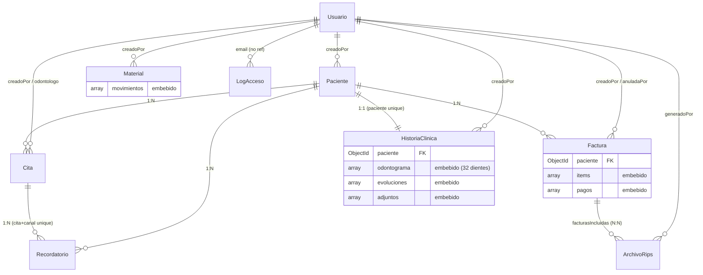

# SERVICIO NACIONAL DE APRENDIZAJE — SENA

**Etapa Productiva — Modalidad Proyecto Productivo**

*Competencia Técnica: Análisis y Desarrollo de Software*

---

# MODELADO E IMPLEMENTACIÓN DE LA BASE DE DATOS (MONGODB)

**Proyecto:** OdontoSoft — Sistema de Gestión Clínica Odontológica

**Cliente:** Consultorio Odontológico Dra. EM (Bogotá D.C.)

**Aprendices:** Juan Carlos Garces Sierra, Juan Pablo Mendez Gil

**Ficha SENA:** 3186265

**Instructor:** Nelson Armando Serrano Hincapie

**Fecha de entrega:** Agosto 2026

---

## CONTENIDO

1. Introducción
2. Modelado NoSQL: Diagrama de Colecciones
3. Esquemas por Colección (Documentos JSON)
4. Decisiones de Embebido vs. Referenciado
5. Script de Inicialización
6. Consultas de Validación (Evidencia CRUD)

---

## 1. INTRODUCCIÓN

OdontoSoft utiliza **MongoDB** como motor de persistencia, a través del ODM **Mongoose** (Node.js). Este documento presenta el modelado NoSQL implementado: sus 10 colecciones, la estructura de cada documento, la relación entre colecciones (embebida o referenciada), el script real de inicialización (`backend/src/scripts/`) y evidencia de operaciones CRUD ejecutadas directamente sobre la base de datos.

**Motor y versión:** MongoDB 7 (contenedor Docker en desarrollo — `docker-compose.yml`; MongoDB Atlas Cluster M0 en producción).

---

## 2. MODELADO NOSQL: DIAGRAMA DE COLECCIONES



**Colecciones físicas en MongoDB** (10 en total): `usuarios`, `pacientes`, `citas`, `historiaclinicas`, `facturas`, `materials`, `recordatorios`, `configuracionmensajes`, `logaccesos`, `tokeninvalidados`, `archivorips`.
*(Nota: Mongoose genera el nombre de colección en plural/minúscula a partir del nombre del modelo; `Material` → `materials`, `ArchivoRips` → `archivorips`).*

---

## 3. ESQUEMAS POR COLECCIÓN (DOCUMENTOS JSON)

A continuación, un documento de ejemplo por colección, tal como quedaría almacenado en MongoDB (simulación fiel al esquema Mongoose real de `backend/src/models/`).

### 3.1 `usuarios`

```json
{
  "_id": "66a1f0c2e4b0a1a2b3c4d5e6",
  "nombre": "Dra. EM",
  "email": "dra.em@consultorio.com",
  "passwordHash": "$2b$12$KIx9v...(60 caracteres bcrypt)",
  "rol": "ODONTOLOGO",
  "estado": "ACTIVO",
  "createdAt": "2026-01-10T13:00:00.000Z",
  "updatedAt": "2026-01-10T13:00:00.000Z"
}
```

> `rol` ∈ {`ADMIN`, `ODONTOLOGO`, `RECEPCIONISTA`}. `passwordHash` se excluye siempre de las respuestas JSON (transform `toJSON` del esquema).

### 3.2 `pacientes`

```json
{
  "_id": "66a1f100e4b0a1a2b3c4d5e7",
  "nombre": "Laura",
  "apellido": "Martínez",
  "tipoDocumento": "CC",
  "numeroDocumento": "1020304050",
  "fechaNacimiento": "1990-05-12T00:00:00.000Z",
  "sexo": "F",
  "telefono": "3011234567",
  "email": "laura.martinez@example.com",
  "direccion": "Cra 45 # 12-30",
  "ciudad": "Bogotá D.C.",
  "eps": "Sura EPS",
  "grupoSanguineo": "O+",
  "alergias": "Penicilina",
  "observaciones": "",
  "estado": "ACTIVO",
  "creadoPor": "66a1f0c2e4b0a1a2b3c4d5e6",
  "createdAt": "2026-02-01T15:00:00.000Z",
  "updatedAt": "2026-02-01T15:00:00.000Z"
}
```

> Índice único compuesto `{tipoDocumento, numeroDocumento}` (RN-02: no duplicar pacientes) e índice de texto sobre `nombre`/`apellido` para búsqueda insensible a mayúsculas.

### 3.3 `citas`

```json
{
  "_id": "66a20011e4b0a1a2b3c4d5e8",
  "paciente": "66a1f100e4b0a1a2b3c4d5e7",
  "odontologo": "66a1f0c2e4b0a1a2b3c4d5e6",
  "fecha": "2026-08-03T00:00:00.000Z",
  "hora": "09:00",
  "duracion": 30,
  "motivo": "Control de rutina",
  "estado": "PROGRAMADA",
  "creadoPor": "66a1f200e4b0a1a2b3c4d5e9",
  "createdAt": "2026-07-28T10:00:00.000Z",
  "updatedAt": "2026-07-28T10:00:00.000Z"
}
```

> Índice compuesto `{odontologo:1, fecha:1}` — acelera la verificación de conflictos de horario (RN-01).

### 3.4 `historiaclinicas` (documento con embebidos: odontograma, evoluciones, adjuntos)

```json
{
  "_id": "66a20055e4b0a1a2b3c4d5ea",
  "paciente": "66a1f100e4b0a1a2b3c4d5e7",
  "antecedentesMedicos": "Hipertensión controlada",
  "odontograma": [
    { "numero": 1, "estado": "SANO", "observaciones": "" },
    { "numero": 2, "estado": "CARIES", "observaciones": "Caries oclusal detectada" },
    "... (32 dientes en total, notación FDI simplificada 1-32)"
  ],
  "evoluciones": [
    {
      "_id": "66a20099e4b0a1a2b3c4d5eb",
      "fecha": "2026-07-15T14:00:00.000Z",
      "odontologo": "66a1f0c2e4b0a1a2b3c4d5e6",
      "descripcion": "Se realiza obturación en diente 2 por caries oclusal",
      "tratamientosRealizados": [
        { "diente": 2, "procedimiento": "Obturación resina", "observaciones": "" }
      ],
      "activo": true,
      "desactivadoPor": null,
      "fechaDesactivacion": null,
      "createdAt": "2026-07-15T14:05:00.000Z"
    }
  ],
  "adjuntos": [
    {
      "_id": "66a200aae4b0a1a2b3c4d5ec",
      "nombreArchivo": "radiografia_diente2.jpg",
      "url": "/uploads/historias-clinicas/3f9a2b7c-....webp",
      "tipo": "RADIOGRAFIA",
      "subidoPor": "66a1f0c2e4b0a1a2b3c4d5e6",
      "fechaSubida": "2026-07-15T14:06:00.000Z"
    }
  ],
  "creadoPor": "66a1f0c2e4b0a1a2b3c4d5e6",
  "createdAt": "2026-07-01T09:00:00.000Z",
  "updatedAt": "2026-07-15T14:06:00.000Z"
}
```

> `paciente` tiene índice **único** (relación 1:1). `odontograma` se inicializa automáticamente con 32 dientes en estado `SANO` al crear la historia (valor por defecto del esquema).

### 3.5 `facturas` (documento con embebidos: items, pagos)

```json
{
  "_id": "66a200bbE4b0a1a2b3c4d5ed",
  "paciente": "66a1f100e4b0a1a2b3c4d5e7",
  "items": [
    {
      "evolucionId": "66a20099e4b0a1a2b3c4d5eb",
      "diente": 2,
      "procedimiento": "Obturación resina",
      "valor": 120000,
      "codigoCups": "230101",
      "diagnostico": "K02.1"
    }
  ],
  "iva": 0,
  "valorTotal": 120000,
  "pagos": [
    { "monto": 100000, "metodoPago": "EFECTIVO", "fecha": "2026-07-15T15:00:00.000Z", "registradoPor": "66a1f200e4b0a1a2b3c4d5e9" }
  ],
  "saldoPendiente": 20000,
  "estado": "PENDIENTE",
  "motivoAnulacion": "",
  "anuladaPor": null,
  "fechaAnulacion": null,
  "creadoPor": "66a1f200e4b0a1a2b3c4d5e9",
  "createdAt": "2026-07-15T15:00:00.000Z",
  "updatedAt": "2026-07-15T15:00:00.000Z"
}
```

> Índice `{paciente:1, createdAt:-1}` — acelera el historial de facturación por paciente.

### 3.6 `materials` (documento con embebido: movimientos)

```json
{
  "_id": "66a200cce4b0a1a2b3c4d5ee",
  "nombre": "Guantes de nitrilo talla M",
  "descripcion": "Caja x100 unidades",
  "costoUnitario": 45000,
  "stock": 12,
  "stockMinimo": 15,
  "proveedor": "Distribuidora Dental S.A.S.",
  "movimientos": [
    { "tipo": "ENTRADA", "cantidad": 20, "motivo": "Compra mensual", "registradoPor": "66a1f200e4b0a1a2b3c4d5e9", "fecha": "2026-07-01T08:00:00.000Z" },
    { "tipo": "SALIDA", "cantidad": 8, "motivo": "Uso en procedimientos del día", "registradoPor": "66a1f200e4b0a1a2b3c4d5e9", "fecha": "2026-07-15T15:10:00.000Z" }
  ],
  "estado": "ACTIVO",
  "creadoPor": "66a1f200e4b0a1a2b3c4d5e9",
  "createdAt": "2026-06-01T08:00:00.000Z",
  "updatedAt": "2026-07-15T15:10:00.000Z"
}
```

### 3.7 `recordatorios`

```json
{
  "_id": "66a200dde4b0a1a2b3c4d5ef",
  "cita": "66a20011e4b0a1a2b3c4d5e8",
  "paciente": "66a1f100e4b0a1a2b3c4d5e7",
  "canal": "EMAIL",
  "mensaje": "Hola Laura Martínez, te recordamos tu cita en OdontoSoft el 3 de agosto de 2026 a las 09:00. ¡Te esperamos!",
  "estado": "ENVIADO",
  "detalleError": "",
  "fechaEnvio": "2026-08-02T09:00:00.000Z",
  "createdAt": "2026-08-02T09:00:00.000Z"
}
```

> Índice único compuesto `{cita:1, canal:1}` — evita reenvíos duplicados del mismo recordatorio.

### 3.8 `configuracionmensajes` (documento singleton)

```json
{
  "_id": "66a1e000e4b0a1a2b3c4d5e5",
  "plantilla": "Hola {nombrePaciente}, te recordamos tu cita en OdontoSoft el {fecha} a las {hora}. ¡Te esperamos!",
  "actualizadoPor": "66a1f200e4b0a1a2b3c4d5e9",
  "createdAt": "2026-01-05T00:00:00.000Z",
  "updatedAt": "2026-01-05T00:00:00.000Z"
}
```

### 3.9 `logaccesos` (auditoría, sin `timestamps` de Mongoose — usa `fecha` propio)

```json
{
  "_id": "66a1e111e4b0a1a2b3c4d5f0",
  "email": "dra.em@consultorio.com",
  "exito": false,
  "motivo": "contraseña incorrecta",
  "ip": "190.85.12.4",
  "userAgent": "Mozilla/5.0 (Windows NT 10.0; Win64; x64)",
  "fecha": "2026-07-20T08:15:00.000Z"
}
```

### 3.10 `tokeninvalidados` (con índice TTL — autolimpieza)

```json
{
  "_id": "66a1e222e4b0a1a2b3c4d5f1",
  "token": "eyJhbGciOiJIUzI1NiIsInR5cCI6IkpXVCJ9...",
  "expiraEn": "2026-07-28T20:00:00.000Z"
}
```

> `expiraEn` tiene un índice `{expireAfterSeconds: 0}`: MongoDB elimina automáticamente el documento cuando esa fecha se cumple (limpieza automática de la "lista negra" de tokens).

### 3.11 `archivorips`

```json
{
  "_id": "66a1e333e4b0a1a2b3c4d5f2",
  "periodo": "2026-07",
  "fechaInicio": "2026-07-01T00:00:00.000Z",
  "fechaFin": "2026-07-31T23:59:59.000Z",
  "facturasIncluidas": ["66a200bbE4b0a1a2b3c4d5ed"],
  "cantidadAtenciones": 1,
  "generadoPor": "66a1f200e4b0a1a2b3c4d5e9",
  "createdAt": "2026-08-01T09:00:00.000Z",
  "updatedAt": "2026-08-01T09:00:00.000Z"
}
```

---

## 4. DECISIONES DE EMBEBIDO VS. REFERENCIADO

| Relación | Tipo elegido | Justificación |
|---|---|---|
| `HistoriaClinica.odontograma/evoluciones/adjuntos` | **Embebido** | Se leen y escriben siempre junto con la historia completa (patrón de acceso "todo o nada"); no se consultan de forma independiente. |
| `Factura.items/pagos` | **Embebido** | Un ítem o pago nunca existe sin su factura; el arreglo es acotado (una factura no crece indefinidamente) y se factura/paga como unidad transaccional. |
| `Material.movimientos` | **Embebido** | El historial de movimientos pertenece exclusivamente a su material y se consulta siempre en el contexto de éste. |
| `Cita.paciente`, `Cita.odontologo` | **Referenciado** (ObjectId + `ref`) | Un paciente y un usuario existen independientemente de cualquier cita concreta y son consultados/editados por su cuenta desde otros módulos. |
| `Factura.paciente`, `HistoriaClinica.paciente` | **Referenciado** | El paciente es una entidad compartida por múltiples módulos (citas, facturas, historia, RIPS); referenciarlo evita duplicar/desincronizar sus datos. |
| `ArchivoRips.facturasIncluidas` | **Referenciado (N:N)** | Un archivo RIPS agrupa muchas facturas ya existentes; no las duplica, solo las enlaza para trazabilidad. |

**Regla general aplicada:** se embebe cuando el subdocumento **no tiene identidad ni ciclo de vida propio** fuera de su documento padre (patrón *contains*); se referencia cuando la entidad relacionada **es consultada de forma independiente** desde otros módulos (patrón *relates-to*). Esta decisión de diseño reduce a **una sola consulta** (`findOne`) la lectura de una historia clínica completa o de una factura completa con su historial de pagos, evitando joins costosos (`$lookup`) en las operaciones más frecuentes del sistema.

---

## 5. SCRIPT DE INICIALIZACIÓN

### 5.1 Creación de colecciones e índices (MongoDB Shell — `mongosh`)

Aunque Mongoose crea las colecciones automáticamente al insertar el primer documento, los **índices declarados en los esquemas** (`backend/src/models/*.js`) son la fuente de verdad. El siguiente script `mongosh` los reproduce explícitamente para fines de evidencia académica y para una carga inicial manual (por ejemplo, en MongoDB Compass):

```javascript
// init-odontosoft.js — ejecutar con: mongosh "mongodb://localhost:27017/odontosoft" init-odontosoft.js

use("odontosoft");

// --- Creación explícita de colecciones ---
db.createCollection("usuarios");
db.createCollection("pacientes");
db.createCollection("citas");
db.createCollection("historiaclinicas");
db.createCollection("facturas");
db.createCollection("materials");
db.createCollection("recordatorios");
db.createCollection("configuracionmensajes");
db.createCollection("logaccesos");
db.createCollection("tokeninvalidados");
db.createCollection("archivorips");

// --- Índices (reflejan los definidos en los esquemas Mongoose) ---
db.usuarios.createIndex({ email: 1 }, { unique: true });

db.pacientes.createIndex({ tipoDocumento: 1, numeroDocumento: 1 }, { unique: true });
db.pacientes.createIndex({ nombre: "text", apellido: "text" });

db.citas.createIndex({ odontologo: 1, fecha: 1 });

db.historiaclinicas.createIndex({ paciente: 1 }, { unique: true });

db.facturas.createIndex({ paciente: 1, createdAt: -1 });

db.materials.createIndex({ nombre: 1 });

db.recordatorios.createIndex({ cita: 1, canal: 1 }, { unique: true });

db.tokeninvalidados.createIndex({ token: 1 }, { unique: true });
db.tokeninvalidados.createIndex({ expiraEn: 1 }, { expireAfterSeconds: 0 }); // TTL

db.archivorips.createIndex({ periodo: 1, createdAt: -1 });

print("✅ Colecciones e índices de OdontoSoft creados correctamente.");
```

### 5.2 Carga de datos base (seed)

La carga de datos base **ya está implementada como scripts Node.js/Mongoose** en el repositorio (no se reinventa en `mongosh`, porque el hash de contraseñas requiere `bcrypt`, disponible solo en Node):

| Script | Ruta | Propósito |
|---|---|---|
| `seedAdmin.js` | `backend/src/scripts/seedAdmin.js` | Crea el usuario `ADMIN` inicial (`admin@odontosoft.com`), con password tomada de `SEED_ADMIN_PASSWORD` (`.env`) o un valor por defecto. Es idempotente: si el admin ya existe, no lo duplica. |
| `seedRoles.js` | `backend/src/scripts/seedRoles.js` | Crea usuarios de prueba para los roles `ODONTOLOGO` y `RECEPCIONISTA`, también de forma idempotente (`findOne` antes de `create`). |

**Ejecución:**

```bash
cd backend
node src/scripts/seedAdmin.js
node src/scripts/seedRoles.js
```

**Resultado esperado en consola:**

```
Admin creado: { nombre: 'Administrador General', email: 'admin@odontosoft.com', rol: 'ADMIN', ... }
Creado: { nombre: 'Dr. Odontólogo Prueba', email: 'odontologo@odontosoft.com', rol: 'ODONTOLOGO', ... }
Creado: { nombre: 'Recepcionista Prueba', email: 'recepcion@odontosoft.com', rol: 'RECEPCIONISTA', ... }
```

**Carga de datos de negocio (pacientes, citas, materiales) — inserción de ejemplo vía `mongosh`:**

```javascript
db.pacientes.insertOne({
  nombre: "Laura",
  apellido: "Martínez",
  tipoDocumento: "CC",
  numeroDocumento: "1020304050",
  fechaNacimiento: ISODate("1990-05-12"),
  sexo: "F",
  telefono: "3011234567",
  eps: "Sura EPS",
  grupoSanguineo: "O+",
  estado: "ACTIVO",
  createdAt: new Date(),
  updatedAt: new Date()
});

db.materials.insertOne({
  nombre: "Guantes de nitrilo talla M",
  costoUnitario: 45000,
  stock: 20,
  stockMinimo: 15,
  proveedor: "Distribuidora Dental S.A.S.",
  movimientos: [],
  estado: "ACTIVO",
  createdAt: new Date(),
  updatedAt: new Date()
});
```

---

## 6. CONSULTAS DE VALIDACIÓN (EVIDENCIA CRUD)

A continuación, las operaciones CRUD fundamentales ejecutadas directamente sobre la base de datos con `mongosh` (equivalentes a lo que se ejecutaría desde MongoDB Compass). Cada bloque debe complementarse con la captura de pantalla de su ejecución real.

### 6.1 CREATE — Insertar un material nuevo

```javascript
db.materials.insertOne({
  nombre: "Anestesia Lidocaína 2%",
  costoUnitario: 8500,
  stock: 50,
  stockMinimo: 10,
  proveedor: "Laboratorios Dentales Andina",
  movimientos: [],
  estado: "ACTIVO",
  createdAt: new Date(),
  updatedAt: new Date()
});
```

**Salida esperada:** `{ acknowledged: true, insertedId: ObjectId('...') }`

📸 **Evidencia:** `[INSERTAR CAPTURA DE PANTALLA — MongoDB Compass / mongosh, resultado del insertOne]`

### 6.2 READ — Consultar pacientes activos con EPS específica

```javascript
db.pacientes.find(
  { estado: "ACTIVO", eps: "Sura EPS" },
  { nombre: 1, apellido: 1, numeroDocumento: 1, telefono: 1 }
).sort({ apellido: 1 });
```

**Salida esperada:** arreglo de documentos con únicamente los campos proyectados (`_id`, `nombre`, `apellido`, `numeroDocumento`, `telefono`).

📸 **Evidencia:** `[INSERTAR CAPTURA DE PANTALLA]`

### 6.3 UPDATE — Registrar una entrada de inventario (actualización atómica con `$push` + `$inc`)

```javascript
db.materials.updateOne(
  { nombre: "Anestesia Lidocaína 2%" },
  {
    $push: {
      movimientos: {
        tipo: "ENTRADA",
        cantidad: 30,
        motivo: "Reposición de stock",
        fecha: new Date()
      }
    },
    $inc: { stock: 30 },
    $set: { updatedAt: new Date() }
  }
);
```

**Salida esperada:** `{ acknowledged: true, matchedCount: 1, modifiedCount: 1 }`. Verificación posterior: `db.materials.findOne({nombre:"Anestesia Lidocaína 2%"}).stock` debe ser `80`.

📸 **Evidencia:** `[INSERTAR CAPTURA DE PANTALLA]`

### 6.4 DELETE — Baja lógica de un paciente (el sistema nunca usa `deleteOne` sobre pacientes; se usa desactivación lógica, ver RN correspondiente)

```javascript
// Baja lógica (la que realmente usa la aplicación — preserva historial/trazabilidad)
db.pacientes.updateOne(
  { numeroDocumento: "1020304050" },
  { $set: { estado: "INACTIVO", updatedAt: new Date() } }
);

// Eliminación física (solo con fines de depuración de datos de prueba, NUNCA en producción)
db.materials.deleteOne({ nombre: "Anestesia Lidocaína 2%" });
```

**Salida esperada (updateOne):** `{ acknowledged: true, matchedCount: 1, modifiedCount: 1 }`.
**Salida esperada (deleteOne):** `{ acknowledged: true, deletedCount: 1 }`.

📸 **Evidencia:** `[INSERTAR CAPTURA DE PANTALLA]`

**Nota de diseño verificada:** ninguna colección del dominio clínico/administrativo (`pacientes`, `citas`, `facturas`, `materials`, `historiaclinicas`) se elimina físicamente desde la aplicación — todas usan **baja lógica** (`estado: 'INACTIVO'`, `estado: 'ANULADA'`, `evolucion.activo = false`), preservando la trazabilidad exigida por las reglas de negocio RN-09/RN-10. El único borrado físico automático en el sistema es el de `tokeninvalidados`, gestionado por el índice TTL de MongoDB.

---

**Elaborado por:**

**Aprendices:** Juan Carlos Garces Sierra, Juan Pablo Mendez Gil

**Ficha SENA:** 3186265

**Fecha:** `[FECHA]`
