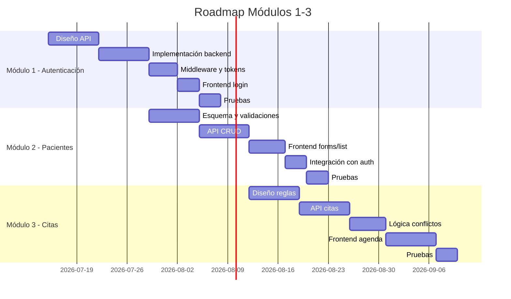

# Diagrama Gantt — Módulos 1–3

```mermaid
gantt
title Roadmap Módulos 1-3
dateFormat  YYYY-MM-DD
section Módulo 1 - Autenticación
Diseño API          :m1a, 2026-07-15, 7d
Implementación backend:m1b, after m1a, 7d
Middleware y tokens  :m1c, after m1b, 4d
Frontend login       :m1d, after m1c, 3d
Pruebas              :m1e, after m1d, 3d
section Módulo 2 - Pacientes
Esquema y validaciones: m2a, 2026-07-29, 7d
API CRUD             :m2b, after m2a, 7d
Frontend forms/list  :m2c, after m2b, 5d
Integración con auth :m2d, after m2c, 3d
Pruebas              :m2e, after m2d, 3d
section Módulo 3 - Citas
Diseño reglas        :m3a, 2026-08-12, 7d
API citas            :m3b, after m3a, 7d
Lógica conflictos    :m3c, after m3b, 5d
Frontend agenda      :m3d, after m3c, 7d
Pruebas              :m3e, after m3d, 3d
```

Referencias: ver `docs/roadmap/issues/` para descripciones y criterios de aceptación.
